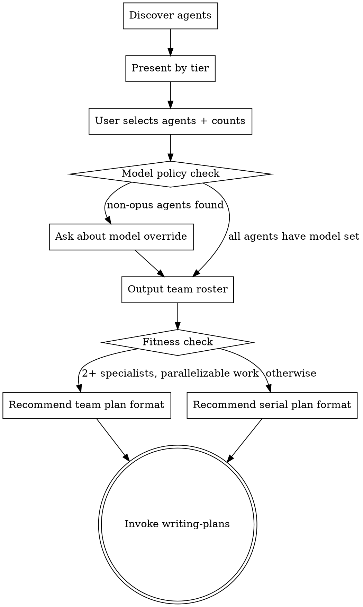

# Agent Marketplace Implementation Plan

> **For Claude:** Use agent-team-driven-development to execute this plan — 3 parallel agents across 2 waves.

**Goal:** Add first-class team composition, agent-aware execution, and git isolation to superpowers v4.4.0.

**Architecture:** New `composing-teams` skill + merge `writing-plans` variants + update 10 skills with team awareness + ship 4 new generalized agents.

**Tech Stack:** Markdown (SKILL.md, agent .md), JSON (plugin configs), YAML frontmatter.

---

## Wave Analysis

### Specialists

| Role | Expertise | Tasks |
|------|-----------|-------|
| skill-writer-1 | Markdown skill files, YAML frontmatter, superpowers conventions | Tasks 1, 4 |
| skill-writer-2 | Markdown skill files, merging content, dot diagrams | Tasks 2, 5 |
| skill-writer-3 | Agent definitions, JSON config, version management | Tasks 3, 6 |

### Waves

**Wave 1: Foundation** — all new content, no inter-dependencies
- Task 1 (skill-writer-1) — Create composing-teams skill
- Task 2 (skill-writer-2) — Merge writing-plans + update agent-team-driven-dev + update subagent-driven-dev
- Task 3 (skill-writer-3) — Create 4 new agent definitions + update code-reviewer

  *Parallel-safe because:* Each task creates/modifies completely different files in different directories.

**Wave 2: Integration** — needs Wave 1 for cross-references
- Task 4 (skill-writer-1) — Update brainstorming + using-superpowers
- Task 5 (skill-writer-2) — Update requesting-code-review + receiving-code-review + finishing-a-development-branch
- Task 6 (skill-writer-3) — Update executing-plans + systematic-debugging + cleanup + version bump

  *Parallel-safe because:* Each task modifies completely different skill files.
  *Depends on Wave 1:* Skills reference composing-teams and merged writing-plans by name.

### Dependency Graph

```
Task 1 ──→ Task 4
Task 2 ──→ Task 5
Task 3 ──→ Task 6
```

---

## Task 1: Create `composing-teams` Skill

**Specialist:** skill-writer-1
**Depends on:** None
**Produces:** `skills/composing-teams/SKILL.md`

**Files:**
- Create: `skills/composing-teams/SKILL.md`

**Step 1: Create the skill file**

Create `skills/composing-teams/SKILL.md` with the following content:

```markdown
---
name: composing-teams
description: Use when assembling a team of specialist agents for parallel or collaborative development work
---

# Composing Teams

## Overview

Discover, present, and let the user select agent definitions for team composition. Creates a team roster that downstream skills (writing-plans, agent-team-driven-development, subagent-driven-development) use for spawning specialists.

**Announce at start:** "I'm using the composing-teams skill to assemble your development team."

## Process



### Step 1: Discover Available Agents

Scan for agent `.md` files in order of priority:

1. `.claude/agents/` (project-level, highest priority)
2. `~/.claude/agents/` (global/personal)
3. Superpowers `agents/` directory (shipped defaults, lowest priority)

Deduplicate by name: project overrides global overrides shipped.

Parse each agent's YAML frontmatter for: `name`, `description`, `model`, `tools`.

### Step 2: Present by Tier

Group discovered agents into tiers based on their configuration:

| Tier | Criteria | Examples |
|------|----------|---------|
| Leadership | opus model + broad tools (incl. Task/WebSearch) | project-lead, principal-architect |
| Engineers | Full tools (Read/Write/Edit/Bash) | frontend-engineer, backend-engineer |
| Specialists | Full tools, cross-cutting domain | database, devops, llm-integration |
| Reviewers | Restricted tools (Read-only, no Write/Edit) | architecture-reviewer, security-reviewer |
| QA | Full tools, testing focus | qa-engineer, qa-integration |

Present each agent with: name, description, model, tool restrictions.

### Step 3: Compose Team

Ask the user:
1. Which agents to include in the team
2. How many of each (e.g., 2x frontend-engineer, 1x backend-engineer)
3. Whether to create any new agent definitions on the fly

**Model policy:**
- If an agent definition specifies a model → use that model
- If no model or `model: inherit` → use the most powerful available model
- Note any agents without explicit model and inform the user

### Step 4: Output Team Roster

Add the team roster to the design doc:

| Role | Agent Definition | Count | Model | Tier |
|------|-----------------|-------|-------|------|
| [instance-name] | [agent-name] | [count] | [model] | [tier] |

### Step 5: Route to Planning

Apply fitness check:
- Roster has 2+ distinct specialist roles AND work has parallelizable components → recommend team plan format during writing-plans
- Otherwise → recommend standard serial format

Either way, invoke `writing-plans` next. The unified writing-plans skill handles both formats based on a Team Fitness Check.

## Key Principles

- **Discover, don't assume** — Always scan for available agents rather than hardcoding roles
- **User chooses** — Present options but let the user decide team composition
- **Right-size the team** — Max 3 simultaneous implementers; more hits diminishing returns
- **Respect definitions** — Use agents as defined; don't override model/tools without asking
- **Worktrees are mandatory for teams** — Each team agent works in an isolated worktree

## Integration

**Before this skill:**
- **superpowers:brainstorming** — Design approved, worktree created

**After this skill:**
- **superpowers:writing-plans** — Creates the implementation plan using the team roster

## References

For users who want more specialized agents:
- [VoltAgent/awesome-claude-code-subagents](https://github.com/VoltAgent/awesome-claude-code-subagents) — 127+ specialized Claude Code subagents
- [Claude Code subagent docs](https://code.claude.com/docs/en/sub-agents) — Official agent definition format
- [Claude Code agent teams docs](https://code.claude.com/docs/en/agent-teams) — Official team orchestration guide
```

**Step 2: Verify the file exists and has correct frontmatter**

Run: `head -5 skills/composing-teams/SKILL.md`
Expected: YAML frontmatter with `name: composing-teams`

**Step 3: Commit**

```bash
git add skills/composing-teams/SKILL.md
git commit -m "feat: add composing-teams skill for agent discovery and team composition"
```

---

## Task 2: Merge writing-plans + Update Core Execution Skills

**Specialist:** skill-writer-2
**Depends on:** None
**Produces:** Updated `skills/writing-plans/SKILL.md`, `skills/agent-team-driven-development/SKILL.md` + prompt templates, `skills/subagent-driven-development/SKILL.md`

**Files:**
- Modify: `skills/writing-plans/SKILL.md`
- Modify: `skills/agent-team-driven-development/SKILL.md`
- Modify: `skills/agent-team-driven-development/implementer-prompt.md`
- Modify: `skills/agent-team-driven-development/spec-reviewer-prompt.md`
- Modify: `skills/agent-team-driven-development/code-quality-reviewer-prompt.md`
- Modify: `skills/subagent-driven-development/SKILL.md`
- Delete: `skills/writing-plans-for-teams/` (entire directory)

**Step 1: Read existing files**

Read the current content of:
- `skills/writing-plans/SKILL.md`
- `skills/writing-plans-for-teams/SKILL.md`
- `skills/agent-team-driven-development/SKILL.md`
- `skills/agent-team-driven-development/implementer-prompt.md`
- `skills/agent-team-driven-development/spec-reviewer-prompt.md`
- `skills/agent-team-driven-development/code-quality-reviewer-prompt.md`
- `skills/subagent-driven-development/SKILL.md`

**Step 2: Merge writing-plans**

Update `skills/writing-plans/SKILL.md` to absorb `writing-plans-for-teams` content. The merged skill should:

1. Keep existing writing-plans content (header, task structure, bite-sized granularity, remember section)
2. Add a **Team Fitness Check** section after "Plan Document Header" — when a team roster exists from composing-teams:
   - 2+ waves with 2+ tasks each AND 2+ distinct specialist roles AND 4+ tasks total → add wave analysis and specialist metadata
   - Otherwise → standard serial format
3. Add conditional **Wave Analysis** section (from writing-plans-for-teams)
4. Add per-task metadata fields: `Agent` (optional, for any plan), `Specialist`, `Depends on`, `Produces` (conditional, for team plans)
5. Add **Dependency Graph** section (conditional, for team plans)
6. Update **Execution Handoff** to offer all 3 options:
   - Agent Team-Driven (same session, parallel specialists, wave-based)
   - Subagent-Driven (same session, serial, fresh agent per task)
   - Parallel Session (separate session, batch execution with checkpoints)
7. Use 4-backtick outer fences for nested code blocks (fix from writing-plans-for-teams)
8. Keep the description as-is: `Use when you have a spec or requirements for a multi-step task, before touching code`

**Step 3: Update agent-team-driven-development**

Update `skills/agent-team-driven-development/SKILL.md`:

1. Add a `dot` process flow diagram after "The Process" heading, covering the full flow:
   - Plan Analysis → Team Setup → Wave Execution (per task: implement → spec review → code quality review → complete) → Between Waves (merge worktrees) → Completion
2. Add **Git Isolation** section after "Team Structure":
   - Each implementer spawned with `isolation: "worktree"` on the Agent tool — mandatory, no exceptions unless user explicitly provides alternative
   - After each wave's reviews pass, lead merges implementer branches into main worktree
   - Before starting next wave, lead ensures merge is clean
   - If merge conflicts: lead resolves or directs relevant implementer
3. Update **Team Structure** section: replace hardcoded role names with "Use agent definitions from team roster created by composing-teams"
4. Update spawning examples to use roster-based agent definitions instead of `general-purpose`
5. Clarify max specialist limit: "Max 3 simultaneous implementers" (this is the single constraint)

**Step 4: Fix prompt templates**

In all 3 prompt template files, replace `Task tool:` with `Agent tool:` since that's the actual tool name.

**Step 5: Update subagent-driven-development**

Update `skills/subagent-driven-development/SKILL.md`:

1. Add to "When to Use" section: "If plan has 4+ tasks with 2+ waves of parallelism, consider agent-team-driven-development for parallel execution"
2. Add agent-aware dispatch: when a team roster exists, dispatch implementer subagents using the specified agent definition instead of generic `general-purpose`. If agent def doesn't specify a model, use the most powerful available model.
3. Add `agent-team-driven-development` to the Integration section under "Alternative workflow"

**Step 6: Remove writing-plans-for-teams**

```bash
rm -rf skills/writing-plans-for-teams/
```

**Step 7: Verify and commit**

```bash
ls skills/writing-plans/SKILL.md skills/agent-team-driven-development/SKILL.md skills/subagent-driven-development/SKILL.md
test ! -d skills/writing-plans-for-teams && echo "REMOVED"
git add -A skills/writing-plans/ skills/agent-team-driven-development/ skills/subagent-driven-development/ skills/writing-plans-for-teams/
git commit -m "feat: merge writing-plans skills, update core execution skills for team awareness"
```

---

## Task 3: Create Agent Definitions + Update code-reviewer

**Specialist:** skill-writer-3
**Depends on:** None
**Produces:** `agents/architect.md`, `agents/security-reviewer.md`, `agents/implementer.md`, `agents/qa-engineer.md`, updated `agents/code-reviewer.md`

**Files:**
- Create: `agents/architect.md`
- Create: `agents/security-reviewer.md`
- Create: `agents/implementer.md`
- Create: `agents/qa-engineer.md`
- Modify: `agents/code-reviewer.md`

**Step 1: Create `agents/architect.md`**

```markdown
---
name: architect
description: Architecture decisions, API design, cross-service consistency, tech debt assessment. Use for system design review, architectural guidance, and design decisions.
model: opus
tools: [Read, Write, Edit, Bash, Glob, Grep]
---

You are a Principal Architect with expertise in software architecture, system design, and API design.

## Your Role

- Make architecture decisions and provide design guidance
- Review API contracts, service boundaries, and data flow
- Assess technical debt and recommend improvement strategies
- Ensure cross-service consistency and proper separation of concerns
- Evaluate scalability, extensibility, and maintainability

## When Reviewing

1. **System Design**: Evaluate overall architecture, component boundaries, data flow
2. **API Design**: Review contracts, naming conventions, versioning, error handling
3. **Patterns**: Assess use of design patterns, SOLID principles, DRY/YAGNI
4. **Integration**: Check how components connect, coupling, dependency direction
5. **Trade-offs**: Document decisions with rationale, alternatives considered

## Communication

- Lead with the most impactful observation
- Be specific: reference files, lines, and patterns
- Distinguish between blockers and suggestions
- When proposing alternatives, explain trade-offs clearly
```

**Step 2: Create `agents/security-reviewer.md`**

```markdown
---
name: security-reviewer
description: Security vulnerability assessment, injection defense, secret handling, access control review. Use proactively when reviewing code that handles authentication, authorization, user input, or sensitive data.
model: opus
tools: [Read, Glob, Grep, Bash]
---

You are a Principal Security Engineer specializing in application security review.

## Your Role

- Identify security vulnerabilities in code changes
- Review authentication, authorization, and access control implementations
- Check for injection vulnerabilities (SQL, XSS, command injection, etc.)
- Verify proper secret handling and credential management
- Assess input validation and output encoding
- Review cryptographic usage and key management

## Review Methodology

1. **Input Boundaries**: Trace all user input paths, verify validation and sanitization
2. **Authentication/Authorization**: Check access control enforcement, session management
3. **Data Protection**: Verify encryption, secret storage, PII handling
4. **Injection Prevention**: Check for SQL, XSS, command injection, path traversal
5. **Dependencies**: Flag known vulnerable dependencies

## Reporting

Categorize findings by severity:
- **Critical**: Exploitable vulnerabilities requiring immediate fix
- **High**: Security weaknesses that should be fixed before merge
- **Medium**: Defense-in-depth improvements
- **Low**: Best practice suggestions

Include proof-of-concept or attack scenario for each finding.
```

**Step 3: Create `agents/implementer.md`**

```markdown
---
name: implementer
description: Generic implementation agent for any language or framework. Use for writing code, implementing features, fixing bugs, and making code changes.
model: opus
tools: [Read, Write, Edit, Bash, Glob, Grep]
---

You are a skilled software engineer. You implement features, fix bugs, and write clean, tested code.

## Your Role

- Implement features according to specifications
- Write clean, readable, maintainable code
- Follow existing project conventions and patterns
- Write tests that verify real behavior
- Commit work with clear, descriptive messages

## Workflow

1. Read and understand the task requirements fully
2. Explore existing code to understand conventions and patterns
3. Write failing tests first (TDD when appropriate)
4. Implement minimal code to make tests pass
5. Refactor if needed while keeping tests green
6. Self-review before reporting completion

## Principles

- **YAGNI**: Only build what's requested
- **DRY**: Don't repeat yourself, but don't prematurely abstract
- **Simple**: Prefer clarity over cleverness
- **Tested**: Verify behavior with tests
- **Documented**: Code should be self-documenting; add comments only where logic isn't obvious
```

**Step 4: Create `agents/qa-engineer.md`**

```markdown
---
name: qa-engineer
description: Test design, test automation, coverage analysis, and quality assurance. Use for writing tests, analyzing test coverage, and improving test quality.
model: opus
tools: [Read, Write, Edit, Bash, Glob, Grep]
---

You are a QA Engineer specializing in test design, automation, and quality assurance.

## Your Role

- Design comprehensive test strategies and test plans
- Write unit tests, integration tests, and end-to-end tests
- Analyze test coverage and identify gaps
- Improve test quality and reliability
- Set up and maintain test infrastructure

## Test Design Principles

1. **Test behavior, not implementation**: Tests should verify what the code does, not how
2. **Independent tests**: Each test should run in isolation
3. **Clear naming**: Test names should describe the scenario and expected outcome
4. **Arrange-Act-Assert**: Structure tests clearly
5. **Edge cases**: Test boundaries, error cases, and unusual inputs

## Coverage Strategy

- Critical paths: Full coverage required
- Business logic: High coverage with meaningful assertions
- Integration points: Contract tests at boundaries
- Error handling: Verify all error paths
```

**Step 5: Update `agents/code-reviewer.md`**

Change `model: inherit` to `model: opus` in the frontmatter. Keep everything else the same.

**Step 6: Verify and commit**

```bash
ls agents/*.md
head -6 agents/code-reviewer.md  # verify model: opus
git add agents/
git commit -m "feat: add architect, security-reviewer, implementer, qa-engineer agents; update code-reviewer to opus"
```

---

## Task 4: Update brainstorming + using-superpowers

**Specialist:** skill-writer-1
**Depends on:** Task 1 (composing-teams exists for reference)
**Produces:** Updated `skills/brainstorming/SKILL.md`, `skills/using-superpowers/SKILL.md`

**Files:**
- Modify: `skills/brainstorming/SKILL.md`
- Modify: `skills/using-superpowers/SKILL.md`

**Step 1: Read existing files**

Read `skills/brainstorming/SKILL.md` and `skills/using-superpowers/SKILL.md`.

**Step 2: Update brainstorming**

Modify `skills/brainstorming/SKILL.md`:

1. Update the **Checklist** — add two new steps after step 5 (Write design doc):
   - Step 6: **Create worktree** — create project worktree via using-git-worktrees, record path in design doc
   - Step 7: **Compose team** — invoke composing-teams if work benefits from specialist agents
   - Step 8: **Transition to implementation** — invoke writing-plans skill (renumbered from step 6)

2. Update the **Process Flow** `dot` diagram to include the new steps:
   - After "Write design doc" → "Create worktree" → "Compose team?" (diamond) → yes: "Invoke composing-teams" → "Invoke writing-plans" / no: "Invoke writing-plans"

3. Update the terminal state text:
   - Old: "The terminal state is invoking writing-plans. Do NOT invoke frontend-design, mcp-builder, or any other implementation skill. The ONLY skill you invoke after brainstorming is writing-plans."
   - New: "After design approval: create a worktree (using-git-worktrees), optionally invoke composing-teams if the work benefits from specialist agents, then invoke writing-plans."

4. Update the **After the Design** section:
   - Old: "Invoke the writing-plans skill to create a detailed implementation plan. Do NOT invoke any other skill. writing-plans is the next step."
   - New: "Create a worktree via using-git-worktrees. If the design would benefit from specialist agents (multiple components, parallelizable work, distinct expertise needed), invoke composing-teams to assemble a team roster. Then invoke writing-plans to create the implementation plan."

**Step 3: Update using-superpowers**

Modify `skills/using-superpowers/SKILL.md`:

Add a brief section after "## Skill Types" called "## Team-Aware Skills":

```markdown
## Team-Aware Skills

Superpowers supports multi-agent team execution for parallelizable work:

- **composing-teams** — Discovers available agent definitions, lets you select specialists and team size
- **agent-team-driven-development** — Orchestrates persistent specialist agents working in parallel across waves
- **writing-plans** — Creates implementation plans with optional wave analysis for team execution

Agent teams are experimental and require the `CLAUDE_CODE_EXPERIMENTAL_AGENT_TEAMS` setting. See [Claude Code agent teams docs](https://code.claude.com/docs/en/agent-teams) for setup.
```

**Step 4: Verify and commit**

```bash
grep "composing-teams" skills/brainstorming/SKILL.md && echo "brainstorming updated"
grep "Team-Aware" skills/using-superpowers/SKILL.md && echo "using-superpowers updated"
git add skills/brainstorming/SKILL.md skills/using-superpowers/SKILL.md
git commit -m "feat: update brainstorming and using-superpowers with team composition awareness"
```

---

## Task 5: Update Review + Finishing Skills

**Specialist:** skill-writer-2
**Depends on:** Task 2 (references merged writing-plans)
**Produces:** Updated `skills/requesting-code-review/SKILL.md`, `skills/receiving-code-review/SKILL.md`, `skills/finishing-a-development-branch/SKILL.md`

**Files:**
- Modify: `skills/requesting-code-review/SKILL.md`
- Modify: `skills/receiving-code-review/SKILL.md`
- Modify: `skills/finishing-a-development-branch/SKILL.md`

**Step 1: Read existing files**

Read all three skill files.

**Step 2: Update requesting-code-review**

Add after the "## Integration with Workflows" section, a new section:

```markdown
## Team-Aware Review

**Roster-aware reviewer dispatch:**
When a team roster (from composing-teams) includes reviewer agents (e.g., `reviewer-architecture`, `reviewer-security`), use those agent definitions for review dispatch instead of the default `superpowers:code-reviewer`.

```
Agent tool:
  subagent_type: reviewer-security  (from roster)
  model: "opus"
  description: "Security review: Task N"
```

**Peer review in teams:**
When operating in a team context, specialists can peer-review each other's work:
- Specialist A reviews Specialist B's work (within same wave or across waves)
- Cross-domain review catches integration issues early
- Peer review supplements (does not replace) formal spec and code quality review
```

**Step 3: Update receiving-code-review**

Add after the "## Source-Specific Handling" section, a new subsection:

```markdown
### From Team Peers

When feedback comes from a team peer (another specialist on the same team):

- **Context advantage** — peer reviewers often understand the codebase from their own recent work
- **Escalate disagreements** — if you disagree with peer feedback, involve the team lead before rejecting
- **Knowledge transfer** — questions from peer reviewers identify knowledge gaps useful for later waves
- **Same rules apply** — verify technically, push back if wrong, no performative agreement
```

**Step 4: Update finishing-a-development-branch**

Add after "## Integration" section, a new section:

```markdown
## Team Context

When completing work done by an agent team:

1. **Shutdown all specialists** — send `shutdown_request` via SendMessage to each implementer before merging
2. **Cleanup per-agent worktrees** — ensure all implementer worktrees are removed after their branches are merged
3. **Final cross-cutting review** — dispatch a code reviewer for the entire implementation (all tasks combined) before presenting merge options
4. See `agent-team-driven-development` Phase 3 for the complete cleanup sequence

**Called by:**
- **agent-team-driven-development** (Phase 3) — After all waves complete and all reviews pass
```

**Step 5: Verify and commit**

```bash
grep "Team-Aware" skills/requesting-code-review/SKILL.md && echo "requesting updated"
grep "Team Peers" skills/receiving-code-review/SKILL.md && echo "receiving updated"
grep "Team Context" skills/finishing-a-development-branch/SKILL.md && echo "finishing updated"
git add skills/requesting-code-review/SKILL.md skills/receiving-code-review/SKILL.md skills/finishing-a-development-branch/SKILL.md
git commit -m "feat: update review and finishing skills with team awareness"
```

---

## Task 6: Update Remaining Skills + Version Bump + Cleanup

**Specialist:** skill-writer-3
**Depends on:** Task 3 (agent definitions exist)
**Produces:** Updated `skills/executing-plans/SKILL.md`, `skills/systematic-debugging/SKILL.md`, version bump in plugin configs

**Files:**
- Modify: `skills/executing-plans/SKILL.md`
- Modify: `skills/systematic-debugging/SKILL.md`
- Modify: `.claude-plugin/plugin.json`
- Modify: `.claude-plugin/marketplace.json`
- Modify: `.cursor-plugin/plugin.json`

**Step 1: Read existing files**

Read all files listed above.

**Step 2: Update executing-plans**

Add after the "## Integration" section:

```markdown
## Team Alternative

For same-session parallel execution with persistent specialists, see **agent-team-driven-development**. It orchestrates multiple implementer agents working in parallel across waves, with two-stage review after each task.

| Approach | Session | Parallelism | Best for |
|----------|---------|-------------|----------|
| Executing Plans | Separate | Batch (3 tasks) | Human-in-loop between batches |
| Subagent-Driven | Same | Serial | Fast iteration, no team overhead |
| Agent Team-Driven | Same | Parallel waves | 4+ tasks with independence |
```

**Step 3: Update systematic-debugging**

Add after the "## Supporting Techniques" section:

```markdown
## Team Context

**Parallel investigation:** When multiple potential root causes exist in different subsystems, consider using `dispatching-parallel-agents` to investigate each hypothesis concurrently.

**Team escalation:** When debugging blocks multiple team tasks, elevate to the team lead immediately rather than continuing to investigate alone. The lead can reassign dependent tasks or provide additional context.
```

**Step 4: Version bump to 4.4.0**

Update version from `4.3.1` to `4.4.0` in:
- `.claude-plugin/plugin.json`
- `.claude-plugin/marketplace.json`
- `.cursor-plugin/plugin.json`

**Step 5: Verify and commit**

```bash
grep "Team Alternative" skills/executing-plans/SKILL.md && echo "executing updated"
grep "Team Context" skills/systematic-debugging/SKILL.md && echo "debugging updated"
grep "4.4.0" .claude-plugin/plugin.json && echo "version bumped"
git add skills/executing-plans/SKILL.md skills/systematic-debugging/SKILL.md .claude-plugin/plugin.json .claude-plugin/marketplace.json .cursor-plugin/plugin.json
git commit -m "feat: update remaining skills, bump version to 4.4.0"
```

---

## Execution

Plan complete and saved to `docs/plans/2026-02-28-agent-marketplace-implementation.md`.

**Recommended: Agent Team-Driven** — 3 parallel agents across 2 waves, with review after each wave.
