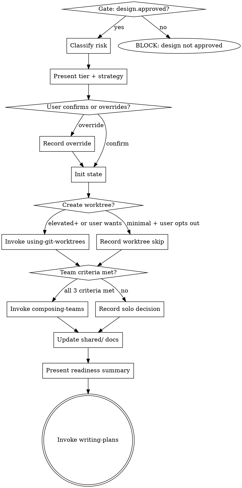

# Task 6: `setting-up-project` Skill

**Specialist:** implementer-3
**Depends on:** Task 3 (risk engine for tier classification), Task 4 (enforcement hooks for state gates), Task 5 (forge-routing routes to this skill after brainstorming)
**Produces:** The new bridge skill between design approval and execution, handling risk classification, worktree creation, state initialization, team decision, and shared doc updates

## Goal

Create the skill that takes a completed design and prepares everything needed for execution: classifying risk, setting up the workspace, initializing state, deciding solo vs team, and updating shared project knowledge.

## Acceptance Criteria

- [ ] Skill description starts with `Use when` and describes triggering conditions only
- [ ] Skill is invoked after brainstorming produces an approved design and before writing-plans creates an execution plan
- [ ] Step 1 -- Risk classification: invokes `classify-risk` with the files/areas identified in the design, presents tier + execution strategy to user, accepts override
- [ ] Step 2 -- State initialization: calls `forge-state init` if not already initialized, then writes `phase: setting-up`, `risk.tier`, `risk.source`, `risk.execution_strategy` to state
- [ ] Step 3 -- Worktree creation: invokes `forge:using-git-worktrees` to create an isolated workspace (required for elevated+, recommended for standard, optional for minimal), records worktree path in state
- [ ] Step 4 -- Team decision: applies structured criteria (4+ tasks, 2+ independent, 2+ specialist domains) from design; invokes `forge:composing-teams` ONLY when all three criteria met; records team decision in state
- [ ] Step 5 -- Shared doc updates: updates `.forge/shared/architecture.md` with design insights (module map, key patterns discovered during brainstorming), updates `.forge/shared/conventions.md` if new conventions were identified
- [ ] Step 6 -- Readiness summary: presents a clear summary of what was set up (tier, worktree path, team composition if any, next step)
- [ ] Gate check: verifies `design.approved: true` in state before proceeding (calls `forge-gate check design.approved`)
- [ ] Hands off to `forge:writing-plans` after setup is complete
- [ ] Stays under 500 lines / 5,000 words
- [ ] Skill includes a process flow diagram (dot format, consistent with other skills)

## Test Expectations

- **Test:** Creates worktree, initializes state, classifies risk correctly, invokes composing-teams when criteria met, skips team for solo work.
- **Expected red failure:** `Error: state not initialized` when forge-state init was not called. Missing risk tier in state after setup runs. Team composed when only 2 tasks exist (should be solo).
- **Expected green:** State shows `risk.tier=elevated`, `worktree.main.path=/path/to/worktree`, `team.decision=solo` (for small projects). For large projects: `team.decision=team`, composing-teams was invoked.

## Files

- Create: `skills/setting-up-project/SKILL.md`
- Test: `tests/skill-triggering/setting-up-project-prompts/` (triggering prompt files)
- Test: `tests/skill-triggering/test-setting-up-project.sh`

## Implementation Notes

**Design reference:** Section 8 of `docs/plans/forge-v0/design.md` -- Phase 2 (Setup) skill description. Also Section 3 for risk model details.

**What was previously bundled in brainstorming (read `skills/brainstorming/SKILL.md`):**
The current brainstorming skill handles steps 10-11 in its checklist:
- Step 10: "Create worktree" -- this moves to setting-up-project Step 3
- Step 11: "Compose team?" -- this moves to setting-up-project Step 4
- Also: state.yml writes for worktree and phase -- these move here

The design explicitly says brainstorming should "produce design doc only. No worktree, no teams, no state setup." This skill absorbs all of that responsibility.

**Referenced skills (read these for interface understanding):**
- `skills/composing-teams/SKILL.md` -- invoked by Step 4 when team criteria met. It discovers agents, presents options, outputs roster.
- `skills/using-git-worktrees/SKILL.md` -- invoked by Step 3. It creates worktree, runs setup, verifies baseline, records path.

**Team decision framework (from brainstorming, preserved here):**

| Criterion | Threshold | Met? |
|-----------|-----------|------|
| Task count | 4+ distinct tasks | |
| Independence | 2+ tasks can run in parallel | |
| Specialist domains | 2+ distinct areas of expertise | |

Compose a team only if ALL three criteria are met.

**Risk tier -> worktree requirement mapping (from design Section 3):**

| Tier | Worktree |
|------|----------|
| Minimal | Optional |
| Standard | Recommended |
| Elevated | Required |
| Critical | Required |

**State writes this skill makes:**
```
phase: setting-up
risk.tier: <minimal|standard|elevated|critical>
risk.source: <policy|inferred|override>
risk.execution_strategy: <solo|team-optional|team-recommended|team-required>
risk.required_artifacts: <comma-separated list>
worktree.main.path: <path>  (if created)
worktree.main.branch: <branch>  (if created)
team.decision: <solo|team>
team.roster: <JSON if team>
```

**Process flow:**


**YAGNI notes:**
- Do NOT implement risk classification logic in the skill -- invoke the `classify-risk` script from Task 3.
- Do NOT implement worktree creation logic -- delegate to `forge:using-git-worktrees`.
- Do NOT implement team composition logic -- delegate to `forge:composing-teams`.
- Do NOT implement planning -- this skill hands off to `forge:writing-plans`.
- Shared doc updates should be lightweight: add section headers or bullet points from the design, not full prose. The design doc itself is the source of truth.

## Commit

`feat: add setting-up-project skill as bridge between design and execution`
