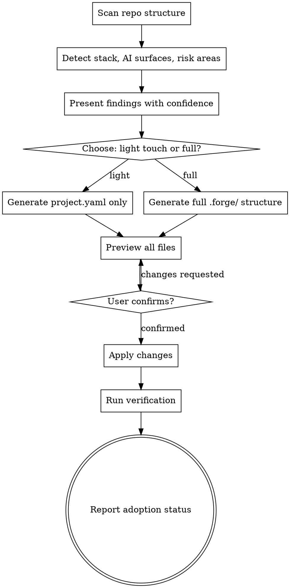

# Task 7: `adopting-forge` Skill

**Specialist:** implementer-2
**Depends on:** Task 1 (`.forge/` structure to create), Task 3 (risk engine for policy generation from detected risk areas), Task 5 (forge-routing routes adoption intents to this skill)
**Produces:** The `adopting-forge` skill that inspects a repo, proposes a Forge layout, and creates the `.forge/` directory with appropriate config

## Goal

Create the skill that brings Forge to an existing repository: scanning its structure, proposing a tailored configuration, previewing all changes, and applying only after explicit user confirmation.

## Acceptance Criteria

- [ ] Skill description starts with `Use when` and describes triggering conditions only
- [ ] **Step 1 -- Inspect:** scans repo structure to detect stack (package.json -> node, Cargo.toml -> rust, etc.), AI surfaces (existing CLAUDE.md, .cursor/, .github/copilot/), risk areas (auth/, migrations/, payment/), and coding conventions (linting config, test patterns, commit style)
- [ ] **Step 2 -- Propose:** presents findings as a structured table with confidence scores (high/medium/low) for each detection
- [ ] **Step 3 -- Choose mode:** offers light touch (project.yaml only, advisory mode) vs full adoption (complete .forge/ directory, CLAUDE.md, enforcement hooks)
- [ ] **Step 4 -- Preview:** shows every file that will be created or modified, with content previews for generated files -- nothing hidden, nothing surprising
- [ ] **Step 5 -- Apply:** creates files ONLY after user explicitly confirms the preview
- [ ] **Step 6 -- Verify:** runs `forge:diagnosing-forge` (or equivalent health checks if that skill doesn't exist yet) to validate the created structure
- [ ] Detects and preserves existing CLAUDE.md content -- appends Forge routing rules rather than overwriting
- [ ] Generates AGENTS.md for Codex compatibility alongside CLAUDE.md
- [ ] Light touch mode creates only `.forge/project.yaml` with detected stack and basic config
- [ ] Full mode creates complete `.forge/` directory: project.yaml, policies/ with detected risk areas, shared/ templates, adapters/ with generated CLAUDE.md source, local/.gitignore
- [ ] Generated policies reflect detected risk areas (e.g., if `auth/` exists -> add critical-tier rule for `auth/**`)
- [ ] Skill stays under 500 lines / 5,000 words; detailed inspection logic goes in `skills/adopting-forge/references/` for progressive disclosure
- [ ] Handles re-adoption gracefully: if `.forge/` already exists, offer to upgrade (light -> full) or refresh without losing customizations

## Test Expectations

- **Test:** Adoption creates `.forge/` and generates CLAUDE.md from repo scan. Light touch mode creates project.yaml only. Full mode creates complete structure. Existing CLAUDE.md is preserved.
- **Expected red failure:** `Error: .forge/ not created` when apply step is skipped or fails. Empty project.yaml with no stack detection after adoption of a Node.js repo. Existing CLAUDE.md content destroyed (overwritten instead of appended).
- **Expected green:** After full adoption of a Node.js repo with auth/ directory: `.forge/project.yaml` has `stack: ["node"]`, `.forge/policies/default.yaml` has `auth/**` rule at critical tier, `CLAUDE.md` contains Forge routing instructions AND preserves original content, `AGENTS.md` exists with Codex-compatible instructions.

## Files

- Create: `skills/adopting-forge/SKILL.md`
- Create: `skills/adopting-forge/references/stack-detection.md` (detailed detection heuristics)
- Create: `skills/adopting-forge/references/generated-claude-md-template.md` (template for CLAUDE.md generation)
- Test: `tests/skill-triggering/adopting-forge-prompts/` (triggering prompt files)
- Test: `tests/skill-triggering/test-adopting-forge.sh`
- Test: `tests/forge-adoption/test-light-touch.sh`
- Test: `tests/forge-adoption/test-full-adoption.sh`
- Test: `tests/forge-adoption/test-preserve-claude-md.sh`

## Implementation Notes

**Design reference:** Section 7 of `docs/plans/forge-v0/design.md` -- full adoption flow, light touch vs full, Codex compatibility, migration path.

**Current harness adapter reference (read `.claude-plugin/plugin.json` and `marketplace.json`):**
The existing plugin generates adapter files for different platforms. The adoption skill should generate similar artifacts but branded as Forge:
- `CLAUDE.md` -- Claude Code / Claude CLI instructions (Forge routing rules + user's existing content)
- `AGENTS.md` -- Codex instructions (equivalent routing, Codex tool names)

**Stack detection heuristics** (reference material for `references/stack-detection.md`):

| Signal | Stack | Confidence |
|--------|-------|------------|
| `package.json` | node | high |
| `tsconfig.json` | typescript | high |
| `Cargo.toml` | rust | high |
| `go.mod` | go | high |
| `pyproject.toml` or `requirements.txt` | python | high |
| `Gemfile` | ruby | high |
| `pom.xml` or `build.gradle` | java | high |
| `.github/workflows/` | ci-github-actions | high |
| `.gitlab-ci.yml` | ci-gitlab | high |
| `docker-compose.yml` | docker | medium |
| `Makefile` | make | low |

**Risk area detection heuristics:**

| Directory/Pattern | Tier | Confidence |
|-------------------|------|------------|
| `auth/`, `authentication/`, `permissions/` | critical | high |
| `db/migrations/`, `migrations/`, `prisma/migrations/` | critical | high |
| `payment/`, `billing/`, `stripe/` | critical | medium |
| `api/public/`, `api/v*/` | elevated | medium |
| `infrastructure/`, `terraform/`, `k8s/` | elevated | medium |
| `docs/`, `*.md` (non-root) | minimal | high |
| `scripts/`, `tools/` | standard | low |

**CLAUDE.md generation approach:**
```markdown
# [Existing CLAUDE.md content preserved above]

# Forge
This project uses Forge for structured AI-assisted development.
Invoke `forge:forge-routing` before any task to ensure correct workflow.
See `.forge/project.yaml` for project configuration.
```

**AGENTS.md generation approach:**
```markdown
# Forge Agent Instructions
This project uses Forge. Follow structured workflows for all development tasks.
[Codex-specific tool mapping and instructions]
```

**Process flow:**


**YAGNI notes:**
- Do NOT implement `syncing-forge` or `diagnosing-forge` -- those are Task 18. Step 6 can do basic file-existence checks if the diagnosis skill is not yet available.
- Do NOT implement pack detection or recommendation -- that is post-v0.
- Do NOT implement convention inference beyond what file presence indicates -- no AST parsing, no code style analysis. Keep detection at the file/directory level.
- Do NOT generate workflow definitions -- `workflows/` is illustrative only in v0.
- The reference files in `references/` are for progressive disclosure: the SKILL.md itself should be concise, with detailed heuristic tables moved to reference files that the LLM can load when needed.

## Commit

`feat: add adopting-forge skill for repo inspection and Forge setup`
