# Agent Team-Driven Development

Execute plans by orchestrating a team of persistent specialist agents working in parallel where possible, with two-stage review (spec compliance then code quality) after each task.

**Core principle:** Wave-based parallel execution + persistent specialist implementers + two-stage review = fast delivery, high quality

## When to Use

- Have an implementation plan with 4+ tasks
- Tasks have identifiable independence (can run in parallel)
- Tasks span 2+ specialist domains
- Want maximum throughput in a single session

**vs. Subagent-Driven Development:**
- Parallel execution across independent tasks
- Persistent implementers fix review issues without context loss
- Specialists carry domain knowledge across waves
- Better for plans with 4+ tasks where parallelism pays off

**Don't use when:**
- Tasks are tightly coupled with no parallelism
- Plan has fewer than 3 tasks (subagent-driven is simpler)
- Tasks each take under a minute (team overhead not worth it)

## Team Structure

| Role | How Spawned | Persistence | Model | Count |
|------|------------|-------------|-------|-------|
| Lead (you) | Main agent | Session lifetime | opus | 1 |
| Specialist Implementer | Agent definition from team roster | Persistent, reused across waves | sonnet | 1 per parallel task (max 3) |
| QA Agent | `superpowers:qa-engineer` or roster entry | Persistent (pipelined TDD) | sonnet | 0-1 |
| Spec Reviewer | Subagent | Fresh per review | sonnet | As needed |
| Code Quality Reviewer | `superpowers:code-reviewer` subagent | Fresh per review | sonnet | As needed |

**Model tiering:** Lead and final reviewers use opus (planning, coordination, judgment). Implementers and spec reviewers use sonnet (sufficient for focused tasks, lower cost). If the user has set model preferences in composing-teams, follow those.

**Agent selection hierarchy:**
1. **Project agents** — if the project has custom agent definitions (e.g., `react-engineer.md` in `.claude/agents/`), use those
2. **Shipped fallback agents** — use `superpowers:code-reviewer`, `superpowers:qa-engineer` etc.
3. **Raw model tiers** — `general-purpose` with sonnet/haiku as last resort

When a roster exists from composing-teams, use the agent definitions and models it specifies.

**Max 3 simultaneous implementers.** More than that hits diminishing returns: git conflicts, resource overhead, harder to coordinate.

**Implementers are team members** because they benefit from persistence:
- Within a task: reviewer finds issues → message the same implementer → they fix without re-learning
- Across waves: implementer who built the schema in wave 1 already knows the codebase for wave 3

**Reviewers are subagents** because they benefit from fresh context — no accumulated bias from watching implementation.

## Pipelined TDD

When a QA agent is in the team roster, use pipelined TDD:

| Wave | QA does | Implementers do |
|------|---------|-----------------|
| Wave 0 | Write tests for Wave 1 tasks | — |
| Wave 1 | Write tests for Wave 2 tasks | Implement Wave 1 (tests already exist) |
| Wave N | Write tests for Wave N+1 tasks | Implement Wave N |
| Final wave | Verify all tests pass | Implement final tasks |

**QA writes in the lead's worktree** (not a separate QA worktree). Test files don't conflict with implementer worktrees. Implementers branch from the lead's worktree where tests already exist.

**Without a QA agent:** Implementers follow solo TDD — write test first, watch it fail, implement to pass.

## Evidence Requirements

Before marking any task complete, the implementer MUST provide:

1. **Command evidence** — test output showing tests pass:
   ```
   Command: npm test
   Output: 34 passed, 0 failed
   Exit: 0
   ```

2. **Diff evidence** — what changed:
   ```
   Commit: abc1234
   git diff --stat: 3 files changed, 87 insertions(+), 12 deletions(-)
   ```

Reports without this evidence are sent back: "Missing evidence. Required: command evidence (test output) + diff evidence (commit SHA + stat)."

For pipelined TDD, also require:
- **RED evidence** — test failed before implementation (from QA agent's run)
- **GREEN evidence** — test passes after implementation

## Git Isolation and Worktree Lifecycle

**Per-agent worktrees are mandatory.** Each implementer MUST be spawned with `isolation: "worktree"`. No exceptions unless the user explicitly provides an alternative.

**Lifecycle:**
1. Each implementer gets their own worktree automatically via `isolation: "worktree"`
2. Implementers commit to their worktree's branch
3. Lead records each implementer's worktree in state.yml under `worktree.implementers.<name>`
4. After each wave's reviews pass, lead merges implementer branches into main worktree
5. Before starting next wave, lead verifies merge is clean and all tests pass
6. Next wave's implementers branch from the clean merged state

**Between waves:**
- All implementer branches from current wave must be merged before next wave starts
- Lead runs tests on merged result to verify integration
- Message existing implementers with next wave's tasks + context from previous waves
- If a wave needs a different specialty, shut down the unneeded implementer and spawn a new specialist

**Merge conflict resolution:** Lead resolves directly or directs the relevant implementer. Never ask another implementer to fix a peer's conflict.

## State Tracking

After each wave completes, update `.superpowers/state.yml`:

```yaml
plan:
  completed_tasks: [1, 2, 3]   # add task numbers as they complete
  current_wave: 2               # increment after wave completes

worktree:
  implementers:
    react-engineer:
      path: /tmp/.claude/worktrees/wt-abc123
      branch: wt-abc123
      last_sha: abc1234          # update after each commit
```

On session resume (cold start), read state.yml to find `plan.current_wave` and `plan.completed_tasks` — skip completed tasks, resume from current wave.

## Pre-Flight Context Check

Before starting each new wave, check context remaining:

```
IF context remaining < 50%:
  Run /compact before spawning next wave
  Brief implementers to refresh their own context if needed
```

Ignoring context exhaustion mid-wave causes incomplete work and confused implementers.

## The Process

```dot
digraph agent_team {
    rankdir=TB;
    node [shape=box];

    plan_analysis [label="Plan Analysis:\nRead plan, extract tasks,\nanalyze dependencies"];
    team_setup [label="Team Setup:\nGroup into waves,\ndecide specializations,\nTeamCreate, TaskCreate\nRead state.yml if resuming"];
    qa_wave0 [label="If QA in roster:\nWave 0 — QA writes\ntests for Wave 1" style=dashed];
    spawn [label="Spawn Implementers:\nOne per wave-1 task\n(isolation: worktree)"];

    subgraph cluster_wave {
        label="Wave Execution (repeat per wave)";
        style=dashed;

        implement [label="Implementers work\nin parallel (TDD)"];
        evidence_check [label="Evidence received?\n(command + diff)" shape=diamond];
        spec_review [label="Spec Review:\nDispatch per task\n(staggered)"];
        spec_pass [label="Spec passes?" shape=diamond];
        fix_spec [label="Implementer\nfixes spec gaps"];
        code_review [label="Code Quality Review:\nDispatch per task"];
        code_pass [label="Quality passes?" shape=diamond];
        fix_quality [label="Implementer\nfixes quality issues"];
        task_complete [label="Mark task complete\nUpdate state.yml"];
    }

    merge [label="Between Waves:\nMerge worktree branches,\nverify integration\nUpdate state.yml"];
    context_check [label="Context < 50%?" shape=diamond];
    compact [label="/compact"];
    wave_check [label="More waves?" shape=diamond];
    next_wave [label="Assign next wave tasks\nto implementers"];
    final_review [label="Final cross-cutting\ncode review"];
    shutdown [label="Shutdown implementers,\nTeamDelete"];
    finish [label="Use superpowers:\nfinishing-a-development-branch" shape=doublecircle];

    plan_analysis -> team_setup;
    team_setup -> qa_wave0;
    qa_wave0 -> spawn;
    team_setup -> spawn [label="no QA"];
    spawn -> implement;
    implement -> evidence_check;
    evidence_check -> spec_review [label="yes"];
    evidence_check -> implement [label="no — send back"];
    spec_review -> spec_pass;
    spec_pass -> fix_spec [label="no"];
    fix_spec -> spec_review [label="re-review"];
    spec_pass -> code_review [label="yes"];
    code_review -> code_pass;
    code_pass -> fix_quality [label="no"];
    fix_quality -> code_review [label="re-review"];
    code_pass -> task_complete [label="yes"];
    task_complete -> merge;
    merge -> context_check;
    context_check -> compact [label="yes"];
    compact -> wave_check;
    context_check -> wave_check [label="no"];
    wave_check -> next_wave [label="yes"];
    next_wave -> implement;
    wave_check -> final_review [label="no"];
    final_review -> shutdown;
    shutdown -> finish;
}
```



### Phase 1: Plan Analysis & Team Setup

1. **Read state.yml** — if resuming, find `plan.current_wave` and `plan.completed_tasks`, skip to current wave
2. **Read plan** once, extract every task with full description
3. **Analyze dependencies** between tasks (see Dependency Analysis below)
4. **Group into waves** — tasks in same wave must be independent and not touch same files
5. **Decide specializations** — what expertise does each wave need?
6. **Create team** via `TeamCreate`
7. **Create task list** — `TaskCreate` for each task, `TaskUpdate` to set `addBlockedBy` for cross-wave dependencies
8. **Wave 0 (if QA in roster)** — spawn QA agent in lead's worktree, have them write tests for Wave 1 tasks
9. **Spawn implementers** — one per task in wave 1, specialized by role, using agent definitions from team roster and `./implementer-prompt.md`. Each spawned with `isolation: "worktree"`

### Phase 2: Wave Execution

**Per task (staggered — reviews start as each implementer finishes, don't wait for whole wave):**

1. **Implementer reports completion** via `SendMessage` with command evidence + diff evidence
2. **Check evidence** — if missing, send back: "Missing evidence. Required: test output + commit SHA"
3. **Spec review** — dispatch subagent using `./spec-reviewer-prompt.md`
   - If issues: message implementer with specific feedback → they fix → dispatch fresh spec reviewer
   - Re-review loop bound: max 3 cycles, then escalate with rejection history
4. **Code quality review** — dispatch subagent using `./code-quality-reviewer-prompt.md`
   - Same fix loop, same 3-cycle bound
5. **Mark task complete** via `TaskUpdate`, update `plan.completed_tasks` in state.yml

**Staggered reviews within a wave:** While implementer-2 is still coding, implementer-1's completed task can already be under review.

**Between waves:**
- All tasks in current wave must pass both reviews before starting next wave
- Merge all implementer worktree branches into main worktree
- Verify integration by running tests on merged result
- Update `plan.current_wave` in state.yml
- Check context remaining; run `/compact` if below 50%
- Message existing implementers with next wave's tasks + context from previous waves

### Phase 3: Completion

1. All waves done, all tasks reviewed
2. Dispatch final cross-cutting code reviewer (`superpowers:code-reviewer`) for entire implementation
3. Shutdown all implementers via `SendMessage` with `type: "shutdown_request"`
4. `TeamDelete` after all members confirm shutdown
5. Use `superpowers:finishing-a-development-branch`

## Dependency Analysis

**Safe to parallelize (same wave):**
- Different directories/modules
- No import relationship between them
- Different layers (unrelated API routes, unrelated UI pages)
- Different specialists can own them cleanly

**Must serialize (different waves):**
- Task B imports something Task A creates (types, schemas, utilities)
- Both tasks modify the same file
- Task B needs Task A's database table/migration
- Task B calls an API route Task A builds

**When unsure → serialize.** Wrong-wave parallelism causes merge conflicts, far more expensive than time saved.

## Prompt Templates

- `./implementer-prompt.md` — Spawn specialist + follow-up task assignment + review feedback
- `./spec-reviewer-prompt.md` — Dispatch spec compliance reviewer (subagent)
- `./code-quality-reviewer-prompt.md` — Dispatch code quality reviewer (subagent)

**When project agents exist:** Use a minimal spawn prompt — task + context + workflow contract only. Project agents carry their own expertise; don't restate it.

## Red Flags

**Sequencing — never:**
- Start code quality review before spec compliance passes
- Start a new wave before current wave's reviews all pass
- Let an implementer start their next task while their current task has open review issues
- Start work on main/master without explicit user consent
- Skip evidence check (accept completion report without command + diff evidence)

**Parallelism — never:**
- More than 3 simultaneous implementers
- Tasks touching the same files in the same wave
- Proceed when unsure about independence (serialize instead)
- Give an implementer more than one task at a time

**Communication — never:**
- Make implementers read plan files (provide full text)
- Omit previous-wave context when assigning later-wave tasks
- Forward vague review feedback ("there were issues" — give file:line specifics)

**Reviews — never:**
- Skip re-review after fixes
- Let self-review replace actual review
- Skip either review stage (spec compliance AND code quality required)
- Allow more than 3 re-review cycles without escalating

**Recovery:**
- Implementer stuck → check what's blocking via SendMessage, provide guidance
- Implementer failed entirely → shut them down, spawn fresh specialist with context about what went wrong
- Never try to fix manually from the lead (context pollution)

## Team Lifecycle

1. **Create** — `TeamCreate` at start of plan execution
2. **Spawn** — specialists for wave 1 tasks, each with `isolation: "worktree"`
3. **Reuse** — message existing implementers with new tasks for subsequent waves
4. **Shutdown** — `SendMessage` with `type: "shutdown_request"` to each implementer when all their work is reviewed
5. **Delete** — `TeamDelete` after all members confirm shutdown

## Integration

**Before this skill:**
- **superpowers:using-git-worktrees** — Isolated workspace before starting; `worktree.main.path` written to state.yml
- **superpowers:composing-teams** — Assembles team roster with agent definitions
- **superpowers:writing-plans** — Creates the plan this skill executes; `plan.path` in state.yml

**During this skill:**
- **superpowers:test-driven-development** — Implementers follow TDD (solo or pipelined)
- **superpowers:requesting-code-review** — Review methodology for quality reviewers
- **superpowers:verification-before-completion** — Evidence format for completion reports

**After this skill:**
- **superpowers:finishing-a-development-branch** — Merge/PR/cleanup decision

**Reads from state.yml:** `plan.path`, `plan.completed_tasks`, `plan.current_wave`, `worktree.main.path`, `team.roster`
**Writes to state.yml:** `plan.completed_tasks`, `plan.current_wave`, `worktree.implementers.*`, `phase: executing`
