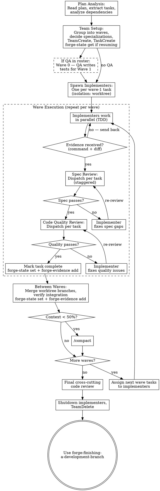

# Agent Team-Driven Development

Execute plans by orchestrating a team of persistent specialist agents working in parallel where possible, with two-stage review (spec compliance then code quality) after each task.

**Core principle:** Wave-based parallel execution + persistent specialist implementers + two-stage review = fast delivery, high quality

## When to Use

**Announce at start:** "I'm using the agent-team-driven-development skill to orchestrate parallel specialist agents."

- Have an implementation plan with 4+ tasks
- Tasks have identifiable independence (can run in parallel)
- Tasks span 2+ specialist domains
- Want maximum throughput in a single session

**vs. Subagent-Driven Development:**
- Parallel execution across independent tasks
- Persistent implementers fix review issues without context loss
- Specialists carry domain knowledge across waves
- Better for plans with 4+ tasks where parallelism pays off

**Don't use when:**
- Tasks are tightly coupled with no parallelism
- Plan has fewer than 3 tasks (subagent-driven is simpler)
- Tasks each take under a minute (team overhead not worth it)

## Team Structure

| Role | How Spawned | Persistence | Model | Count |
|------|------------|-------------|-------|-------|
| Lead (you) | Main agent | Session lifetime | opus | 1 |
| Specialist Implementer | Agent definition from team roster | Persistent, reused across waves | sonnet | 1 per parallel task (max 3) |
| QA Agent | `forge:qa-engineer` or roster entry | Persistent (pipelined TDD) | sonnet | 0-1 |
| Spec Reviewer | Subagent | Fresh per review | sonnet | As needed |
| Code Quality Reviewer | `forge:code-reviewer` subagent | Fresh per review | sonnet | As needed |

**Model tiering:** Lead and final reviewers use opus (planning, coordination, judgment). Implementers and spec reviewers default to sonnet (sufficient for focused tasks, lower cost). If the user has set model preferences in composing-teams, follow those.

**Task-complexity signals for implementer model selection:**
- **Mechanical tasks** (isolated functions, clear specs, 1-2 files, scaffolding): use a fast, cheap model (sonnet or haiku). Most implementation tasks are mechanical when the plan is well-specified.
- **Integration tasks** (multi-file coordination, cross-module wiring, pattern matching): use sonnet.
- **Architecture/design tasks** (broad codebase understanding, design judgment, complex debugging): use opus.

When assigning tasks to waves, note the complexity tier for each task. If a persistent implementer was spawned at a lower model tier but the next wave assigns it an architecture-level task, shut down that implementer and spawn a new one at the higher tier. Only change model tiers between waves — never mid-task.

**Agent selection hierarchy:**
1. **Project agents** — if the project has custom agent definitions (e.g., `react-engineer.md` in `.claude/agents/`), use those
2. **Shipped fallback agents** — use `forge:code-reviewer`, `forge:qa-engineer` etc.
3. **Raw model tiers** — `general-purpose` with sonnet/haiku as last resort

When a roster exists from composing-teams, use the agent definitions and models it specifies.

**Max 3 simultaneous implementers.** More than that hits diminishing returns: git conflicts, resource overhead, harder to coordinate.

**Implementers are team members** because they benefit from persistence:
- Within a task: reviewer finds issues → message the same implementer → they fix without re-learning
- Across waves: implementer who built the schema in wave 1 already knows the codebase for wave 3

**Reviewers are subagents** because they benefit from fresh context — no accumulated bias from watching implementation.

## Pipelined TDD

When a QA agent is in the team roster, use pipelined TDD:

| Wave | Implementers do | QA does (in parallel) |
|------|-----------------|----------------------|
| Wave 0 | Foundation tasks (migrations, config, scaffolding) | Write tests for Wave 1 tasks |
| Wave 1 | Implement Wave 1 (tests already exist) → RED then GREEN | Write tests for Wave 2 tasks |
| Wave N | Implement Wave N → RED then GREEN | Write tests for Wave N+1 tasks |
| Final wave | Implement final tasks | Verify all tests pass |

**QA and implementers work in parallel within each wave.** QA is not a separate sequential step — it runs alongside implementers, writing the next wave's tests while current-wave implementation happens.

**QA writes in the lead's worktree** (not a separate QA worktree). Test files don't conflict with implementer worktrees. Implementers branch from the lead's worktree where tests already exist.

**Without a QA agent:** Implementers follow solo TDD — write test first, watch it fail, implement to pass.

## Evidence Requirements

Before marking any task complete, the implementer MUST provide:

1. **Command evidence** — test output showing tests pass:
   ```
   Command: npm test
   Output: 34 passed, 0 failed
   Exit: 0
   ```

2. **Diff evidence** — what changed:
   ```
   Commit: abc1234
   git diff --stat: 3 files changed, 87 insertions(+), 12 deletions(-)
   ```

Reports without this evidence are sent back: "Missing evidence. Required: command evidence (test output) + diff evidence (commit SHA + stat)."

For pipelined TDD, also require:
- **RED evidence** — test failed before implementation (from QA agent's run)
- **GREEN evidence** — test passes after implementation

## Git Isolation and Worktree Lifecycle

**Per-agent worktrees are mandatory.** Each implementer MUST work in an isolated worktree. No exceptions unless the user explicitly provides an alternative.

**Claude Code:** Use `isolation: "worktree"` on the Agent tool — worktrees are created and cleaned up automatically.

**Cursor / Codex / other platforms:** Create worktrees manually before dispatching each implementer:

```bash
git worktree add .worktrees/<implementer-name> -b <implementer-name>
```

Then point the implementer at the worktree path.

**Lifecycle:**
1. Each implementer gets their own worktree (automatically via `isolation: "worktree"` in Claude Code, or manually created on other platforms)
2. Implementers commit to their worktree's branch
3. Lead records each implementer's worktree via `forge-state set worktree.implementers.<name>.*`
4. After each wave's reviews pass, lead merges implementer branches into main worktree
5. Before starting next wave, lead verifies merge is clean and all tests pass
6. Next wave's implementers branch from the clean merged state

**Between waves:**
- All implementer branches from current wave must be merged before next wave starts
- Lead runs tests on merged result to verify integration
- Message existing implementers with next wave's tasks + context from previous waves
- If a wave needs a different specialty, shut down the unneeded implementer and spawn a new specialist

**Merge conflict resolution:** Lead resolves directly or directs the relevant implementer. Never ask another implementer to fix a peer's conflict.

## State Tracking

After each wave completes, update `.forge/` state:

```bash
forge-state set plan.completed_tasks "[1, 2, 3]"   # add task numbers as they complete
forge-state set plan.current_wave 2                  # increment after wave completes

forge-state set worktree.implementers.react-engineer.path /tmp/.claude/worktrees/wt-abc123
forge-state set worktree.implementers.react-engineer.branch wt-abc123
forge-state set worktree.implementers.react-engineer.last_sha abc1234

forge-evidence add task-3 command "npm test: 34 passed, 0 failed, exit 0"
forge-evidence add task-3 diff "abc1234: 3 files changed, 87 insertions(+), 12 deletions(-)"
```

On session resume (cold start), read state via `forge-state get plan.current_wave` and `forge-state get plan.completed_tasks` — skip completed tasks, resume from current wave.

## Pre-Flight Context Check

Before starting each new wave, check context remaining:

```
IF context remaining < 50%:
  Run /compact before spawning next wave
  Brief implementers to refresh their own context if needed
```

Ignoring context exhaustion mid-wave causes incomplete work and confused implementers.

## The Process


```dot
digraph agent_team {
    rankdir=TB;
    node [shape=box];

    plan_analysis [label="Plan Analysis:\nRead plan, extract tasks,\nanalyze dependencies"];
    team_setup [label="Team Setup:\nGroup into waves,\ndecide specializations,\nTeamCreate, TaskCreate\nforge-state get if resuming"];
    qa_wave0 [label="If QA in roster:\nWave 0 — QA writes\ntests for Wave 1" style=dashed];
    spawn [label="Spawn Implementers:\nOne per wave-1 task\n(isolation: worktree)"];

    subgraph cluster_wave {
        label="Wave Execution (repeat per wave)";
        style=dashed;

        implement [label="Implementers work\nin parallel (TDD)"];
        evidence_check [label="Evidence received?\n(command + diff)" shape=diamond];
        spec_review [label="Spec Review:\nDispatch per task\n(staggered)"];
        spec_pass [label="Spec passes?" shape=diamond];
        fix_spec [label="Implementer\nfixes spec gaps"];
        code_review [label="Code Quality Review:\nDispatch per task"];
        code_pass [label="Quality passes?" shape=diamond];
        fix_quality [label="Implementer\nfixes quality issues"];
        task_complete [label="Mark task complete\nforge-state set + forge-evidence add"];
    }

    merge [label="Between Waves:\nMerge worktree branches,\nverify integration\nforge-state set + forge-evidence add"];
    context_check [label="Context < 50%?" shape=diamond];
    compact [label="/compact"];
    wave_check [label="More waves?" shape=diamond];
    next_wave [label="Assign next wave tasks\nto implementers"];
    final_review [label="Final cross-cutting\ncode review"];
    shutdown [label="Shutdown implementers,\nTeamDelete"];
    finish [label="Use forge:finishing-\na-development-branch" shape=doublecircle];

    plan_analysis -> team_setup;
    team_setup -> qa_wave0;
    qa_wave0 -> spawn;
    team_setup -> spawn [label="no QA"];
    spawn -> implement;
    implement -> evidence_check;
    evidence_check -> spec_review [label="yes"];
    evidence_check -> implement [label="no — send back"];
    spec_review -> spec_pass;
    spec_pass -> fix_spec [label="no"];
    fix_spec -> spec_review [label="re-review"];
    spec_pass -> code_review [label="yes"];
    code_review -> code_pass;
    code_pass -> fix_quality [label="no"];
    fix_quality -> code_review [label="re-review"];
    code_pass -> task_complete [label="yes"];
    task_complete -> merge;
    merge -> context_check;
    context_check -> compact [label="yes"];
    compact -> wave_check;
    context_check -> wave_check [label="no"];
    wave_check -> next_wave [label="yes"];
    next_wave -> implement;
    wave_check -> final_review [label="no"];
    final_review -> shutdown;
    shutdown -> finish;
}
```

### Phase 1: Plan Analysis & Team Setup

1. **Read `.forge/` state** — if resuming, `forge-state get plan.current_wave` and `forge-state get plan.completed_tasks`, skip to current wave
2. **Read plan** once, extract every task with full description
3. **Analyze dependencies** between tasks (see Dependency Analysis below)
4. **Group into waves** — tasks in same wave must be independent and not touch same files
5. **Decide specializations** — what expertise does each wave need?
6. **Create team** via `TeamCreate`
7. **Create task list** — `TaskCreate` for each task, `TaskUpdate` to set `addBlockedBy` for cross-wave dependencies
8. **Wave 0 (if QA in roster)** — spawn QA agent in lead's worktree, have them write tests for Wave 1 tasks
9. **Spawn implementers** — one per task in wave 1, specialized by role, using agent definitions from team roster and `./implementer-prompt.md`. Each must have its own worktree (via `isolation: "worktree"` in Claude Code, or manually created on other platforms)

### Phase 2: Wave Execution

**Per task (staggered — reviews start as each implementer finishes, don't wait for whole wave):**

1. **Implementer reports completion** via `SendMessage` with command evidence + diff evidence
2. **Check evidence** — if missing, send back: "Missing evidence. Required: test output + commit SHA"
3. **Check implementer status** — handle the reported status before proceeding to review:
   - **DONE:** Proceed to spec review.
   - **DONE_WITH_CONCERNS:** Read the concerns. If about correctness or scope, address before review (message the implementer for clarification or fixes). If observational (e.g., "this file is getting large"), note them and proceed.
   - **NEEDS_CONTEXT:** Provide the missing context via `SendMessage` to the same persistent implementer. They continue without re-learning.
   - **BLOCKED:** Assess the blocker:
     1. Context problem → provide more context via `SendMessage`, implementer retries
     2. Needs more reasoning → shut down this implementer, spawn a new one at a higher model tier (e.g., sonnet → opus) with the task context and what was attempted
     3. Task too large → break into sub-tasks and assign across the current wave's remaining capacity
     4. Plan itself is wrong → escalate to the user

   **Never** ignore an escalation or force the same implementer to retry without changes. If they said they are stuck, something needs to change. Persistent implementers can receive new context via `SendMessage` — only re-spawn when the model tier needs to change.
4. **Spec review** — dispatch subagent using `./spec-reviewer-prompt.md`
   - If issues: message implementer with specific feedback → they fix → dispatch fresh spec reviewer
   - Re-review loop bound: max 3 cycles, then escalate with rejection history
5. **Code quality review** — dispatch subagent using `./code-quality-reviewer-prompt.md`
   - Same fix loop, same 3-cycle bound
6. **Mark task complete** via `TaskUpdate`, `forge-state set plan.completed_tasks`, `forge-evidence add <task-id> <artifact>`

**Risk-tier-aware review ceremony:** Scale review depth to the project's risk tier (from `forge-state get risk.tier`):
- **Minimal tier:** Light review — single combined spec+quality pass per task
- **Standard tier:** Standard two-stage review (spec compliance then code quality)
- **Elevated tier:** Standard two-stage + `forge:validating-wave-compliance` between waves
- **Critical tier:** Standard two-stage + `forge:validating-wave-compliance` + security review pass between waves

**Pipelined TDD enforcement:** If QA wrote tests for this wave, verify each implementer's completion report includes both RED evidence (QA's test failed before implementation) and GREEN evidence (test passes after). Reject reports missing either.

**Staggered reviews within a wave:** While implementer-2 is still coding, implementer-1's completed task can already be under review.

**Between waves:**
1. All tasks in current wave must pass both reviews before starting next wave
2. Merge all implementer worktree branches into main worktree
3. Verify integration by running tests on merged result
3.5. **Wave validation (elevated/critical tiers):** Dispatch `forge:validating-wave-compliance` to verify cross-task consistency, evidence completeness, and integration health before proceeding. At elevated tier, this is advisory; at critical tier, failures block the next wave.
4. **If QA in roster:** Have QA agent write tests for next+1 wave's tasks in the lead's worktree (e.g., while Wave 2 implementers work, QA writes tests for Wave 3). This keeps the pipeline flowing — implementers always have pre-written tests waiting.
5. Aggregate wave evidence: `forge-evidence add wave-<N> command "<merged test results>"` and `forge-evidence add wave-<N> diff "<merge commit SHA + stat>"`
6. Update `forge-state set plan.current_wave <N+1>`
7. Check context remaining; run `/compact` if below 50%
8. Message existing implementers with next wave's tasks + context from previous waves. **If QA wrote tests:** include the test file paths so implementers run them RED before implementing.

### Phase 3: Completion

1. All waves done, all tasks reviewed
2. Dispatch final cross-cutting code reviewer (`forge:code-reviewer`) for entire implementation
3. **Clean up task list** — mark all remaining `in_progress` tasks as `completed` via `TaskUpdate`. This includes implementer tasks, review tasks, QA tasks, and any other sub-tasks created during execution. Do this BEFORE shutdown so the status line reflects completion.
4. Shutdown all implementers via `SendMessage` with `type: "shutdown_request"` (recipient = implementer name)
5. `TeamDelete` (takes no parameters — uses current session's team context)
6. Use `forge:finishing-a-development-branch`

**Resilience:** Each cleanup step (3–6) is independent. If one fails, log the error and continue with the next. A failed `TeamDelete` must not block task cleanup or branch finishing.

### Cross-Task Dependency Check

Before marking the plan complete, review all completed tasks together for cross-task issues:
- Import/export mismatches between tasks that were implemented in parallel
- Shared state assumptions that conflict across task boundaries
- Interface contracts that evolved during implementation but weren't propagated
- Test assertions in one task that depend on implementation details of another

## Dependency Analysis

**Safe to parallelize (same wave):**
- Different directories/modules
- No import relationship between them
- Different layers (unrelated API routes, unrelated UI pages)
- Different specialists can own them cleanly

**Must serialize (different waves):**
- Task B imports something Task A creates (types, schemas, utilities)
- Both tasks modify the same file
- Task B needs Task A's database table/migration
- Task B calls an API route Task A builds

**When unsure → serialize.** Wrong-wave parallelism causes merge conflicts, far more expensive than time saved.

## Prompt Templates

- `./implementer-prompt.md` — Spawn specialist + follow-up task assignment + review feedback
- `./spec-reviewer-prompt.md` — Dispatch spec compliance reviewer (subagent)
- `./code-quality-reviewer-prompt.md` — Dispatch code quality reviewer (subagent)

**When project agents exist:** Use a minimal spawn prompt — task + context + workflow contract only. Project agents carry their own expertise; don't restate it.

## Red Flags

**Sequencing — never:**
- Start code quality review before spec compliance passes
- Start a new wave before current wave's reviews all pass
- Let an implementer start their next task while their current task has open review issues
- Start work on main/master without explicit user consent
- Skip evidence check (accept completion report without command + diff evidence)

**Parallelism — never:**
- More than 3 simultaneous implementers
- Tasks touching the same files in the same wave
- Proceed when unsure about independence (serialize instead)
- Give an implementer more than one task at a time

**Communication — never:**
- Make implementers read plan files (provide full text)
- Omit previous-wave context when assigning later-wave tasks
- Forward vague review feedback ("there were issues" — give file:line specifics)

**Reviews — never:**
- Skip re-review after fixes
- Let self-review replace actual review
- Skip either review stage (spec compliance AND code quality required)
- Allow more than 3 re-review cycles without escalating

**Cleanup — never:**
- Skip task list cleanup (leaves `in_progress` tasks causing stuck status spinners)
- Let a failed `TeamDelete` or `SendMessage` block subsequent cleanup steps
- Finish without marking all sub-tasks (impl-task-*, review-task-*, qa-wave*, etc.) as completed

**Recovery:**
- Implementer stuck → check what's blocking via SendMessage, provide guidance
- Implementer failed entirely → shut them down, spawn fresh specialist with context about what went wrong
- Cleanup step fails → log the error, continue with next cleanup step (task cleanup, shutdown, TeamDelete, and finishing are each independent)
- Never try to fix manually from the lead (context pollution)

## Team Lifecycle

1. **Create** — `TeamCreate` at start of plan execution
2. **Spawn** — specialists for wave 1 tasks, each with its own worktree
3. **Reuse** — message existing implementers with new tasks for subsequent waves
4. **Shutdown** — `SendMessage` with `type: "shutdown_request"` to each implementer when all their work is reviewed
5. **Delete** — `TeamDelete` after all members confirm shutdown

## Integration

**Before this skill:**
- **forge:using-git-worktrees** — Isolated workspace before starting; `forge-state set worktree.main.path`
- **forge:composing-teams** — Assembles team roster with agent definitions
- **forge:writing-plans** — Creates the plan this skill executes; `forge-state set plan.path`

**During this skill:**
- **forge:test-driven-development** — Implementers follow TDD (solo or pipelined)
- **forge:requesting-code-review** — Review methodology for quality reviewers
- **forge:verification-before-completion** — Evidence format for completion reports
- **forge:validating-wave-compliance** — Cross-task compliance check between waves (elevated/critical tiers)

**After this skill:**
- **forge:finishing-a-development-branch** — Merge/PR/cleanup decision

**Reads from `.forge/` state:** `plan.path`, `plan.completed_tasks`, `plan.current_wave`, `worktree.main.path`, `team.roster`
**Writes to `.forge/` state:** `plan.completed_tasks`, `plan.current_wave`, `worktree.implementers.*`, `phase: executing`
