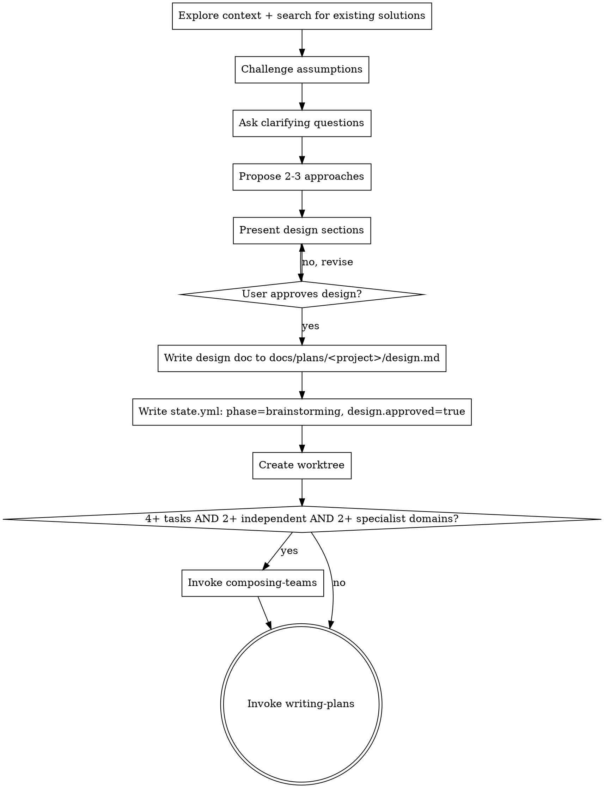

# Brainstorming Ideas Into Designs

## Overview

Help turn ideas into fully formed designs and specs through natural collaborative dialogue.

Start by understanding the current project context, then ask questions one at a time to refine the idea. Once you understand what you're building, present the design and get user approval.

<HARD-GATE>
Do NOT invoke any implementation skill, write any code, scaffold any project, or take any implementation action until you have presented a design and the user has approved it. This applies to EVERY project regardless of perceived simplicity.
</HARD-GATE>

## Anti-Pattern: "This Is Too Simple To Need A Design"

Every project goes through this process. A todo list, a single-function utility, a config change — all of them. "Simple" projects are where unexamined assumptions cause the most wasted work. The design can be short (a few sentences for truly simple projects), but you MUST present it and get approval.

## Checklist

You MUST create a task for each of these items and complete them in order:

1. **Explore project context** — check files, docs, recent commits; search for existing solutions before designing
2. **Challenge assumptions** — ask: Is this the right problem? Are there simpler alternatives?
3. **Ask clarifying questions** — one at a time, understand purpose/constraints/success criteria
4. **Propose 2-3 approaches** — with trade-offs and your recommendation
5. **Present design** — in sections scaled to their complexity, get user approval after each section
6. **Write design doc** — save to `docs/plans/<project>/design.md` and commit; write `design.approved: true` to `.superpowers/state.yml`
7. **Create worktree** — create project worktree via using-git-worktrees, record path in state.yml
8. **Compose team?** — apply the decision framework below; invoke composing-teams only if criteria met
9. **Transition to implementation** — invoke writing-plans skill to create implementation plan

## Process Flow



## The Process

**Step 1 — Explore and research:**
- Check current project state: files, docs, recent commits
- Search for existing solutions on GitHub/web before designing new ones
- A solution that already exists is often better than a custom one

**Step 2 — Challenge assumptions:**
- Before accepting the user's framing, ask: Is this the right problem to solve?
- Are there simpler alternatives that avoid the complexity entirely?
- Only one challenge at a time — don't barrage with questions

**Step 3 — Ask clarifying questions:**
- One at a time, understand purpose, constraints, success criteria
- Prefer multiple choice when possible, open-ended is fine too

**Step 4 — Explore approaches:**
- Propose 2-3 different approaches with trade-offs
- Lead with your recommended option and explain why

**Step 5 — Present design:**
- Scale each section to its complexity: a few sentences if straightforward, up to 200-300 words if nuanced
- Ask after each section whether it looks right so far
- Cover: architecture, components, data flow, error handling, testing
- Be ready to revise based on feedback

## After the Design

**Documentation (step 6):**
- Write the validated design to `docs/plans/<project>/design.md` (directory-based, never overwritten by later skills)
- Commit the design document to git
- Write `.superpowers/state.yml`:
  ```yaml
  phase: brainstorming
  design:
    path: docs/plans/<project>/design.md
    approved: true
    approved_at: <timestamp>
  ```

**Worktree (step 7):**
- Create worktree via `superpowers:using-git-worktrees`
- State.yml is updated by that skill with `worktree.main.*`

**Team decision (step 8):**

Apply this structured decision framework — do NOT compose a team based on vibes:

| Criterion | Threshold | Met? |
|-----------|-----------|------|
| Task count | 4+ distinct tasks | |
| Independence | 2+ tasks can run in parallel | |
| Specialist domains | 2+ distinct areas of expertise | |

**Compose a team only if ALL three criteria are met.** Otherwise skip directly to writing-plans.

**Implementation (step 9):**
- Invoke `superpowers:writing-plans` to create the implementation plan

## Key Principles

- **One question at a time** — Don't overwhelm with multiple questions
- **Multiple choice preferred** — Easier to answer than open-ended when possible
- **YAGNI ruthlessly** — Remove unnecessary features from all designs
- **Research first** — Search for existing solutions before designing custom ones
- **Challenge the problem** — Is this the right problem? Are there simpler alternatives?
- **Explore alternatives** — Always propose 2-3 approaches before settling
- **Incremental validation** — Present design, get approval before moving on
- **Be flexible** — Go back and clarify when something doesn't make sense
- **design.md is immutable** — Later skills (writing-plans, executors) must never overwrite it
