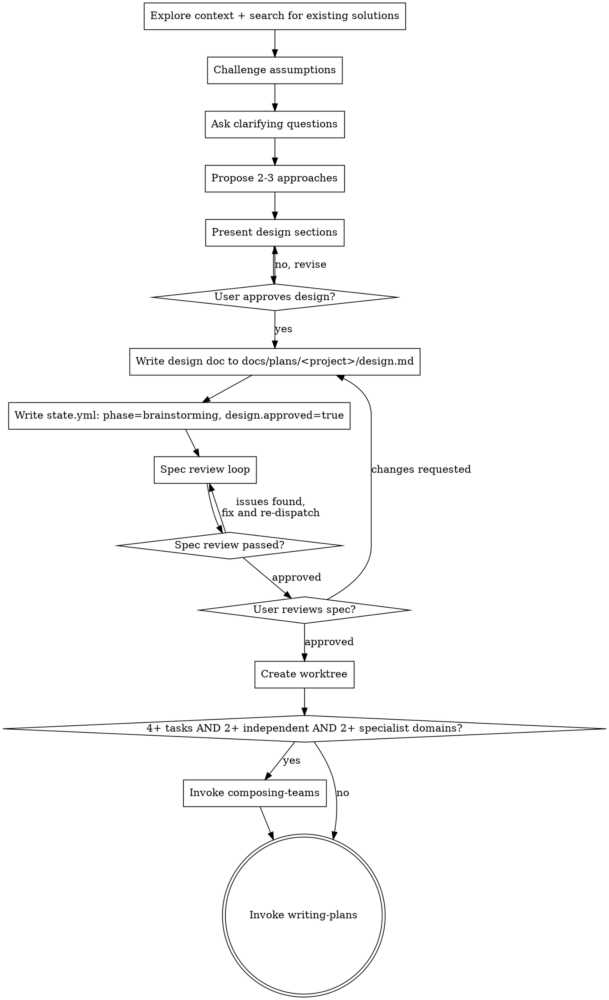

# Brainstorming Ideas Into Designs

## Overview

Help turn ideas into fully formed designs and specs through natural collaborative dialogue.

**Announce at start:** "I'm using the brainstorming skill to explore and design before implementing."

Start by understanding the current project context, then ask questions one at a time to refine the idea. Once you understand what you're building, present the design and get user approval.

<HARD-GATE>
Do NOT invoke any implementation skill, write any code, scaffold any project, or take any implementation action until you have presented a design and the user has approved it. This applies to EVERY project regardless of perceived simplicity.
</HARD-GATE>

<HARD-GATE>
Do NOT use `EnterPlanMode` or `ExitPlanMode` during brainstorming. These tools trap the session in plan mode where Write/Edit tools are restricted, preventing the brainstorming skill from writing the design document. Use the brainstorming skill's own structured process instead.
</HARD-GATE>

## Anti-Pattern: "This Is Too Simple To Need A Design"

Every project goes through this process. A todo list, a single-function utility, a config change — all of them. "Simple" projects are where unexamined assumptions cause the most wasted work. The design can be short (a few sentences for truly simple tasks), but you MUST present it and get approval before proceeding to implementation.

## Checklist

You MUST create a task for each of these items and complete them in order:

1. **Explore project context** — check files, docs, recent commits; search for existing solutions before designing
2. **Offer visual companion** (if topic will involve visual questions) — this is its own message, not combined with a clarifying question. See the Visual Companion section below.
3. **Challenge assumptions** — ask: Is this the right problem? Are there simpler alternatives?
4. **Ask clarifying questions** — one at a time, understand purpose/constraints/success criteria
5. **Propose 2-3 approaches** — with trade-offs and your recommendation
6. **Present design** — in sections scaled to their complexity, get user approval after each section
7. **Write design doc** — save to `docs/plans/<project>/design.md` and commit; write `design.approved: true` to `.superpowers/state.yml`
8. **Spec review loop** — dispatch spec-document-reviewer subagent; fix issues and re-dispatch until approved (max 5 iterations, then surface to human)
9. **User reviews written spec** — ask user to review the spec file before proceeding
10. **Create worktree** — create project worktree via using-git-worktrees, record path in state.yml
11. **Compose team?** — apply the decision framework below; invoke composing-teams only if criteria met
12. **Transition to implementation** — invoke writing-plans skill to create implementation plan

## Process Flow


```dot
digraph brainstorming {
    "Explore context + search for existing solutions" [shape=box];
    "Challenge assumptions" [shape=box];
    "Ask clarifying questions" [shape=box];
    "Propose 2-3 approaches" [shape=box];
    "Present design sections" [shape=box];
    "User approves design?" [shape=diamond];
    "Write design doc to docs/plans/<project>/design.md" [shape=box];
    "Write state.yml: phase=brainstorming, design.approved=true" [shape=box];
    "Spec review loop" [shape=box];
    "Spec review passed?" [shape=diamond];
    "User reviews spec?" [shape=diamond];
    "Create worktree" [shape=box];
    "4+ tasks AND 2+ independent AND 2+ specialist domains?" [shape=diamond];
    "Invoke composing-teams" [shape=box];
    "Invoke writing-plans" [shape=doublecircle];

    "Explore context + search for existing solutions" -> "Challenge assumptions";
    "Challenge assumptions" -> "Ask clarifying questions";
    "Ask clarifying questions" -> "Propose 2-3 approaches";
    "Propose 2-3 approaches" -> "Present design sections";
    "Present design sections" -> "User approves design?";
    "User approves design?" -> "Present design sections" [label="no, revise"];
    "User approves design?" -> "Write design doc to docs/plans/<project>/design.md" [label="yes"];
    "Write design doc to docs/plans/<project>/design.md" -> "Write state.yml: phase=brainstorming, design.approved=true";
    "Write state.yml: phase=brainstorming, design.approved=true" -> "Spec review loop";
    "Spec review loop" -> "Spec review passed?";
    "Spec review passed?" -> "Spec review loop" [label="issues found,\nfix and re-dispatch"];
    "Spec review passed?" -> "User reviews spec?" [label="approved"];
    "User reviews spec?" -> "Write design doc to docs/plans/<project>/design.md" [label="changes requested"];
    "User reviews spec?" -> "Create worktree" [label="approved"];
    "Create worktree" -> "4+ tasks AND 2+ independent AND 2+ specialist domains?";
    "4+ tasks AND 2+ independent AND 2+ specialist domains?" -> "Invoke composing-teams" [label="yes"];
    "4+ tasks AND 2+ independent AND 2+ specialist domains?" -> "Invoke writing-plans" [label="no"];
    "Invoke composing-teams" -> "Invoke writing-plans";
}
```

## The Process

**Step 1 — Explore and research:**
- Check current project state: files, docs, recent commits
- Search for existing solutions on GitHub/web before designing new ones
- A solution that already exists is often better than a custom one

**Step 2 — Challenge assumptions:**
- Before accepting the user's framing, ask: Is this the right problem to solve?
- Are there simpler alternatives that avoid the complexity entirely?
- Only one challenge at a time — don't barrage with questions

**Step 3 — Ask clarifying questions:**
- One at a time, understand purpose, constraints, success criteria
- Prefer multiple choice when possible, open-ended is fine too

**Step 4 — Explore approaches:**
- Propose 2-3 different approaches with trade-offs
- Lead with your recommended option and explain why

**Step 5 — Present design:**
- Scale each section to its complexity: a few sentences if straightforward, up to 200-300 words if nuanced
- Ask after each section whether it looks right so far
- Cover: architecture, components, data flow, error handling
- **Testing strategy** — explicitly address:
  - What needs tests (unit, integration, e2e)?
  - If the project will have 4+ parallelizable tasks: recommend **pipelined TDD** — within each wave, a QA agent writes failing tests for the NEXT wave's tasks in parallel while implementers work on the CURRENT wave. Implementers always have pre-written tests to run RED then GREEN. Wave 0 can combine foundation work (migrations, config) with QA writing tests for Wave 1.
  - If solo/serial execution: recommend **solo TDD** — each agent writes its own test first
  - Include test expectations per component (what to test, expected failures)
- Be ready to revise based on feedback

## After the Design

**Documentation (step 6):**
- Write the validated design to `docs/plans/<project>/design.md` (directory-based, never overwritten by later skills)
- Commit the design document to git
- Write `.superpowers/state.yml`:
  ```yaml
  phase: brainstorming
  design:
    path: docs/plans/<project>/design.md
    approved: true
    approved_at: <timestamp>
  ```

**Spec Review Loop:**
After writing the spec document:

1. Dispatch spec-document-reviewer subagent (see spec-document-reviewer-prompt.md)
2. If Issues Found: fix, re-dispatch, repeat until Approved
3. If loop exceeds 5 iterations, surface to human for guidance

**User Review Gate:**
After the spec review loop passes, ask the user to review the written spec before proceeding:

> "Spec written and committed to `<path>`. Please review it and let me know if you want to make any changes before we start writing out the implementation plan."

Wait for the user's response. If they request changes, make them and re-run the spec review loop. Only proceed once the user approves.

**Worktree:**
- Create worktree via `superpowers:using-git-worktrees`
- State.yml is updated by that skill with `worktree.main.*`

**Team decision:**

Apply this structured decision framework — do NOT compose a team based on vibes:

| Criterion | Threshold | Met? |
|-----------|-----------|------|
| Task count | 4+ distinct tasks | |
| Independence | 2+ tasks can run in parallel | |
| Specialist domains | 2+ distinct areas of expertise | |

**Compose a team only if ALL three criteria are met.** Otherwise skip directly to writing-plans.

**If composing a team:** recommend a QA/test-writer agent for pipelined TDD when the project has testable code. This enables the interleaved wave pattern: QA writes tests one wave ahead, implementers always have failing tests waiting. See `superpowers:agent-team-driven-development` Pipelined TDD section.

Present your team composition recommendation to the user and ask for confirmation before proceeding.

**Implementation:**
- Invoke `superpowers:writing-plans` to create the implementation plan
- Ask the user if they are satisfied with the brainstorming output and ready to transition to implementation planning before invoking writing-plans.

## Key Principles

- **One question at a time** — Don't overwhelm with multiple questions
- **Multiple choice preferred** — Easier to answer than open-ended when possible
- **YAGNI ruthlessly** — Remove unnecessary features from all designs
- **Research first** — Search for existing solutions before designing custom ones
- **Challenge the problem** — Is this the right problem? Are there simpler alternatives?
- **Explore alternatives** — Always propose 2-3 approaches before settling
- **Incremental validation** — Present design, get approval before moving on
- **Be flexible** — Go back and clarify when something doesn't make sense
- **design.md is immutable** — Later skills (writing-plans, executors) must never overwrite it
