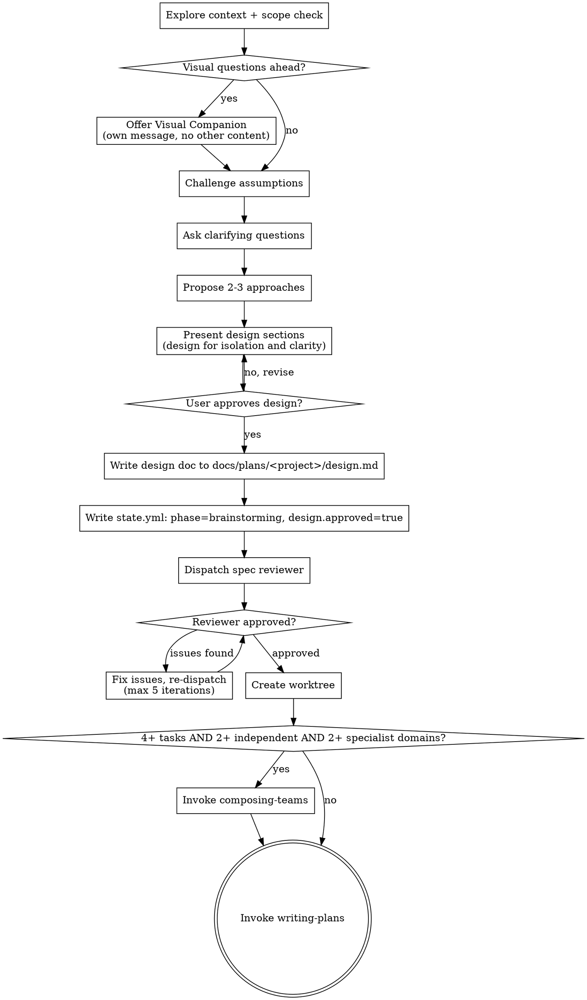

# Brainstorming Ideas Into Designs

## Overview

Help turn ideas into fully formed designs and specs through natural collaborative dialogue.

**Announce at start:** "I'm using the brainstorming skill to explore and design before implementing."

Start by understanding the current project context, then ask questions one at a time to refine the idea. Once you understand what you're building, present the design and get user approval.

<HARD-GATE>
Do NOT invoke any implementation skill, write any code, scaffold any project, or take any implementation action until you have presented a design and the user has approved it. This applies to EVERY project regardless of perceived simplicity.
</HARD-GATE>

<HARD-GATE>
Do NOT use `EnterPlanMode` or `ExitPlanMode` during brainstorming. These tools trap the session in plan mode where Write/Edit tools are restricted, preventing the brainstorming skill from writing the design document. Use the brainstorming skill's own structured process instead.
</HARD-GATE>

## Anti-Pattern: "This Is Too Simple To Need A Design"

Every project goes through this process. A todo list, a single-function utility, a config change — all of them. "Simple" projects are where unexamined assumptions cause the most wasted work. The design can be short (a few sentences for truly simple tasks), but you MUST present it and get approval before proceeding to implementation.

## Checklist

You MUST create a task for each of these items and complete them in order:

1. **Explore project context** — check files, docs, recent commits; search for existing solutions before designing; assess scope and decompose multi-subsystem requests
2. **Offer visual companion** — if topic will involve visual questions, offer for consent (its own message, not combined with other content). See the Visual Companion section below.
3. **Challenge assumptions** — ask: Is this the right problem? Are there simpler alternatives?
4. **Ask clarifying questions** — one at a time, understand purpose/constraints/success criteria
5. **Propose 2-3 approaches** — with trade-offs and your recommendation
6. **Present design** — in sections scaled to their complexity, design for isolation and clarity, get user approval after each section
7. **Write design doc** — save to `docs/plans/<project>/design.md` and commit; write `design.approved: true` to `.superpowers/state.yml`
8. **Spec review loop** — dispatch reviewer subagent, iterate until approved (max 5 rounds)
9. **Create worktree** — create project worktree via using-git-worktrees, record path in state.yml
10. **Compose team?** — apply the decision framework below; invoke composing-teams only if criteria met; transition to implementation via writing-plans

## Process Flow


```dot
digraph brainstorming {
    "Explore context + scope check" [shape=box];
    "Visual questions ahead?" [shape=diamond];
    "Offer Visual Companion\n(own message, no other content)" [shape=box];
    "Challenge assumptions" [shape=box];
    "Ask clarifying questions" [shape=box];
    "Propose 2-3 approaches" [shape=box];
    "Present design sections\n(design for isolation and clarity)" [shape=box];
    "User approves design?" [shape=diamond];
    "Write design doc to docs/plans/<project>/design.md" [shape=box];
    "Write state.yml: phase=brainstorming, design.approved=true" [shape=box];
    "Dispatch spec reviewer" [shape=box];
    "Reviewer approved?" [shape=diamond];
    "Fix issues, re-dispatch\n(max 5 iterations)" [shape=box];
    "Create worktree" [shape=box];
    "4+ tasks AND 2+ independent AND 2+ specialist domains?" [shape=diamond];
    "Invoke composing-teams" [shape=box];
    "Invoke writing-plans" [shape=doublecircle];

    "Explore context + scope check" -> "Visual questions ahead?";
    "Visual questions ahead?" -> "Offer Visual Companion\n(own message, no other content)" [label="yes"];
    "Visual questions ahead?" -> "Challenge assumptions" [label="no"];
    "Offer Visual Companion\n(own message, no other content)" -> "Challenge assumptions";
    "Challenge assumptions" -> "Ask clarifying questions";
    "Ask clarifying questions" -> "Propose 2-3 approaches";
    "Propose 2-3 approaches" -> "Present design sections\n(design for isolation and clarity)";
    "Present design sections\n(design for isolation and clarity)" -> "User approves design?";
    "User approves design?" -> "Present design sections\n(design for isolation and clarity)" [label="no, revise"];
    "User approves design?" -> "Write design doc to docs/plans/<project>/design.md" [label="yes"];
    "Write design doc to docs/plans/<project>/design.md" -> "Write state.yml: phase=brainstorming, design.approved=true";
    "Write state.yml: phase=brainstorming, design.approved=true" -> "Dispatch spec reviewer";
    "Dispatch spec reviewer" -> "Reviewer approved?";
    "Reviewer approved?" -> "Fix issues, re-dispatch\n(max 5 iterations)" [label="issues found"];
    "Reviewer approved?" -> "Create worktree" [label="approved"];
    "Fix issues, re-dispatch\n(max 5 iterations)" -> "Reviewer approved?";
    "Create worktree" -> "4+ tasks AND 2+ independent AND 2+ specialist domains?";
    "4+ tasks AND 2+ independent AND 2+ specialist domains?" -> "Invoke composing-teams" [label="yes"];
    "4+ tasks AND 2+ independent AND 2+ specialist domains?" -> "Invoke writing-plans" [label="no"];
    "Invoke composing-teams" -> "Invoke writing-plans";
}
```

## The Process

**Step 1 — Explore and research:**
- Check current project state: files, docs, recent commits
- Search for existing solutions on GitHub/web before designing new ones
- A solution that already exists is often better than a custom one
- Before asking detailed questions, assess scope: if the request describes multiple independent subsystems (e.g., "build a platform with chat, file storage, billing, and analytics"), flag this immediately. Don't spend questions refining details of a project that needs to be decomposed first.
- If the project is too large for a single spec, help the user decompose into sub-projects: what are the independent pieces, how do they relate, what order should they be built? Then brainstorm the first sub-project through the normal design flow. Each sub-project gets its own spec, plan, and implementation cycle.

**Step 2 — Offer visual companion:**
- When you anticipate that upcoming questions will involve visual content (mockups, layouts, diagrams), offer the visual companion once for consent
- This offer MUST be its own message — do not combine it with clarifying questions, context summaries, or any other content
- If they decline, proceed with text-only brainstorming
- Even after the user accepts, decide FOR EACH QUESTION whether to use the browser or the terminal: would the user understand this better by seeing it than reading it?
- If they agree, read the detailed guide before proceeding: `skills/brainstorming/visual-companion.md`

**Step 3 — Challenge assumptions:**
- Before accepting the user's framing, ask: Is this the right problem to solve?
- Are there simpler alternatives that avoid the complexity entirely?
- Only one challenge at a time — don't barrage with questions

**Step 4 — Ask clarifying questions:**
- One at a time, understand purpose, constraints, success criteria
- Prefer multiple choice when possible, open-ended is fine too

**Step 5 — Explore approaches:**
- Propose 2-3 different approaches with trade-offs
- Lead with your recommended option and explain why

**Step 6 — Present design:**
- Scale each section to its complexity: a few sentences if straightforward, up to 200-300 words if nuanced
- Ask after each section whether it looks right so far
- Cover: architecture, components, data flow, error handling
- **Design for isolation and clarity:**
  - Break the system into smaller units that each have one clear purpose, communicate through well-defined interfaces, and can be understood and tested independently
  - For each unit, you should be able to answer: what does it do, how do you use it, and what does it depend on?
  - Can someone understand what a unit does without reading its internals? Can you change the internals without breaking consumers? If not, the boundaries need work.
  - Smaller, well-bounded units are also easier for you to work with — you reason better about code you can hold in context at once, and your edits are more reliable when files are focused. When a file grows large, that's often a signal that it's doing too much.
- **Working in existing codebases:**
  - Explore the current structure before proposing changes. Follow existing patterns.
  - Where existing code has problems that affect the work (e.g., a file that's grown too large, unclear boundaries, tangled responsibilities), include targeted improvements as part of the design — the way a good developer improves code they're working in.
  - Don't propose unrelated refactoring. Stay focused on what serves the current goal.
- **Testing strategy** — explicitly address:
  - What needs tests (unit, integration, e2e)?
  - If the project will have 4+ parallelizable tasks: recommend **pipelined TDD** — within each wave, a QA agent writes failing tests for the NEXT wave's tasks in parallel while implementers work on the CURRENT wave. Implementers always have pre-written tests to run RED then GREEN. Wave 0 can combine foundation work (migrations, config) with QA writing tests for Wave 1.
  - If solo/serial execution: recommend **solo TDD** — each agent writes its own test first
  - Include test expectations per component (what to test, expected failures)
- Be ready to revise based on feedback

## After the Design

**Documentation (step 7):**
- Write the validated design to `docs/plans/<project>/design.md` (directory-based, never overwritten by later skills)
- Commit the design document to git
- Write `.superpowers/state.yml`:
  ```yaml
  phase: brainstorming
  design:
    path: docs/plans/<project>/design.md
    approved: true
    approved_at: <timestamp>
  ```

**Spec Review Loop (step 8):**

After writing the design document:

1. Dispatch spec-document-reviewer subagent (see `skills/brainstorming/spec-document-reviewer-prompt.md`)
2. If Issues Found: fix the design doc, re-dispatch reviewer, repeat until Approved
3. If the loop exceeds 5 iterations, surface to your human partner for guidance

**Worktree (step 9):**
- Create worktree via `superpowers:using-git-worktrees`
- State.yml is updated by that skill with `worktree.main.*`

**Team decision (step 10):**

Apply this structured decision framework — do NOT compose a team based on vibes:

| Criterion | Threshold | Met? |
|-----------|-----------|------|
| Task count | 4+ distinct tasks | |
| Independence | 2+ tasks can run in parallel | |
| Specialist domains | 2+ distinct areas of expertise | |

**Compose a team only if ALL three criteria are met.** Otherwise skip directly to writing-plans.

**If composing a team:** recommend a QA/test-writer agent for pipelined TDD when the project has testable code. This enables the interleaved wave pattern: QA writes tests one wave ahead, implementers always have failing tests waiting. See `superpowers:agent-team-driven-development` Pipelined TDD section.

Present your team composition recommendation to the user and ask for confirmation before proceeding.

**Implementation (transition to writing-plans):**
- Invoke `superpowers:writing-plans` to create the implementation plan
- Ask the user if they are satisfied with the brainstorming output and ready to transition to implementation planning before invoking writing-plans.

## Visual Companion

A browser-based companion for showing mockups, diagrams, and visual options during brainstorming. Available as a tool — not a mode. Accepting the companion means it's available for questions that benefit from visual treatment; it does NOT mean every question goes through the browser.

**Offering the companion:** When you anticipate that upcoming questions will involve visual content (mockups, layouts, diagrams), offer it once for consent:
> "Some of what we're working on might be easier to explain if I can show it to you in a web browser. I can put together mockups, diagrams, comparisons, and other visuals as we go. This feature is still new and can be token-intensive. Want to try it? (Requires opening a local URL)"

**This offer MUST be its own message.** Do not combine it with clarifying questions, context summaries, or any other content. The message should contain ONLY the offer above and nothing else. Wait for the user's response before continuing. If they decline, proceed with text-only brainstorming.

**Per-question decision:** Even after the user accepts, decide FOR EACH QUESTION whether to use the browser or the terminal. The test: **would the user understand this better by seeing it than reading it?**

- **Use the browser** for content that IS visual — mockups, wireframes, layout comparisons, architecture diagrams, side-by-side visual designs
- **Use the terminal** for content that is text — requirements questions, conceptual choices, tradeoff lists, A/B/C/D text options, scope decisions

A question about a UI topic is not automatically a visual question. "What does personality mean in this context?" is a conceptual question — use the terminal. "Which wizard layout works better?" is a visual question — use the browser.

If they agree to the companion, read the detailed guide before proceeding:
`skills/brainstorming/visual-companion.md`

## Key Principles

- **One question at a time** — Don't overwhelm with multiple questions
- **Multiple choice preferred** — Easier to answer than open-ended when possible
- **YAGNI ruthlessly** — Remove unnecessary features from all designs
- **Research first** — Search for existing solutions before designing custom ones
- **Challenge the problem** — Is this the right problem? Are there simpler alternatives?
- **Explore alternatives** — Always propose 2-3 approaches before settling
- **Incremental validation** — Present design, get approval before moving on
- **Be flexible** — Go back and clarify when something doesn't make sense
- **design.md is immutable** — Later skills (writing-plans, executors) must never overwrite it
