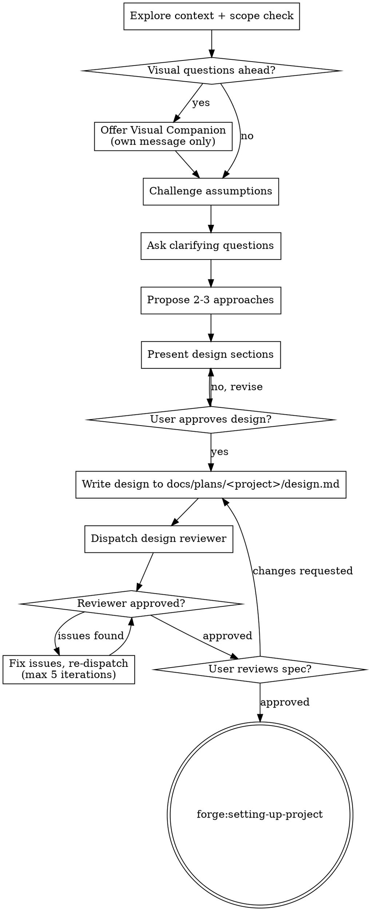

# Brainstorming Ideas Into Designs

## Overview

Turn ideas into fully formed designs through collaborative dialogue. This skill ends with an approved design document committed to the repo. Worktree creation, team composition, and project setup are handled by `forge:setting-up-project` after approval.

**Announce at start:** "I'm using the brainstorming skill to explore and design before implementing."

<HARD-GATE>
Do NOT invoke any implementation skill, write any code, or take any implementation action until you have presented a design and the user has approved it. This applies to every project regardless of perceived simplicity.
</HARD-GATE>

<HARD-GATE>
Do NOT use `EnterPlanMode` or `ExitPlanMode` during brainstorming. These tools restrict Write/Edit access, preventing the design doc from being written. Use this skill's structured process instead.
</HARD-GATE>

## Anti-Pattern: "This Is Too Simple To Need A Design"

Every project goes through this process. Simple projects are where unexamined assumptions cause the most wasted work. The design can be short (a few sentences), but you MUST present it and get approval before proceeding.

## Checklist

Create a task for each item and complete them in order:

1. **Explore project context** — check files, docs, recent commits; search for existing solutions; assess scope and decompose multi-subsystem requests
2. **Offer visual companion** — if visual questions are ahead, offer consent (its own message, no other content)
3. **Challenge assumptions** — Is this the right problem? Are there simpler alternatives?
4. **Ask clarifying questions** — one at a time; purpose, constraints, success criteria
5. **Propose 2-3 approaches** — with trade-offs and your recommendation
6. **Present design** — sections scaled to complexity; design for isolation and clarity; get user approval
7. **Write design doc** — save to `docs/plans/<project>/design.md`; commit to git
8. **Design review loop** — dispatch reviewer subagent; iterate until approved (max 5 rounds)
9. **User reviews written spec** — ask user to review before proceeding
10. **Hand off** — invoke `forge:setting-up-project` to create worktree, detect stack, and compose team

## Process Flow


```dot
digraph brainstorming {
    "Explore context + scope check" [shape=box];
    "Visual questions ahead?" [shape=diamond];
    "Offer Visual Companion\n(own message only)" [shape=box];
    "Challenge assumptions" [shape=box];
    "Ask clarifying questions" [shape=box];
    "Propose 2-3 approaches" [shape=box];
    "Present design sections" [shape=box];
    "User approves design?" [shape=diamond];
    "Write design to docs/plans/<project>/design.md" [shape=box];
    "Dispatch design reviewer" [shape=box];
    "Reviewer approved?" [shape=diamond];
    "Fix issues, re-dispatch\n(max 5 iterations)" [shape=box];
    "User reviews spec?" [shape=diamond];
    "forge:setting-up-project" [shape=doublecircle];

    "Explore context + scope check" -> "Visual questions ahead?";
    "Visual questions ahead?" -> "Offer Visual Companion\n(own message only)" [label="yes"];
    "Visual questions ahead?" -> "Challenge assumptions" [label="no"];
    "Offer Visual Companion\n(own message only)" -> "Challenge assumptions";
    "Challenge assumptions" -> "Ask clarifying questions";
    "Ask clarifying questions" -> "Propose 2-3 approaches";
    "Propose 2-3 approaches" -> "Present design sections";
    "Present design sections" -> "User approves design?";
    "User approves design?" -> "Present design sections" [label="no, revise"];
    "User approves design?" -> "Write design to docs/plans/<project>/design.md" [label="yes"];
    "Write design to docs/plans/<project>/design.md" -> "Dispatch design reviewer";
    "Dispatch design reviewer" -> "Reviewer approved?";
    "Reviewer approved?" -> "Fix issues, re-dispatch\n(max 5 iterations)" [label="issues found"];
    "Reviewer approved?" -> "User reviews spec?" [label="approved"];
    "Fix issues, re-dispatch\n(max 5 iterations)" -> "Reviewer approved?";
    "User reviews spec?" -> "Write design to docs/plans/<project>/design.md" [label="changes requested"];
    "User reviews spec?" -> "forge:setting-up-project" [label="approved"];
}
```

## The Process

**Step 1 — Explore and research:**
- Check current project state: files, docs, recent commits
- Search for existing solutions before designing new ones
- Assess scope: flag multi-subsystem requests early and help decompose before asking detailed questions

**Step 2 — Offer visual companion:**
- When visual questions are ahead, offer the companion once for consent
- This offer MUST be its own message — do not combine with any other content
- If they agree, read `skills/brainstorming/visual-companion.md` before proceeding

**Step 3 — Challenge assumptions:**
- Before accepting the user's framing: Is this the right problem?
- Are there simpler alternatives? One challenge at a time.

**Step 4 — Ask clarifying questions:**
- One at a time; understand purpose, constraints, success criteria
- Prefer multiple choice when possible

**Step 5 — Explore approaches:**
- Propose 2-3 approaches with trade-offs
- Lead with your recommended option and explain why

**Step 6 — Present design:**
- Scale each section to its complexity
- Ask after each section whether it looks right so far
- Cover: architecture, components, data flow, error handling
- **Design for isolation and clarity:** break into units with one clear purpose, well-defined interfaces, independently testable
- **Working in existing codebases:** explore structure first; follow existing patterns; improve code you're working in, don't propose unrelated refactoring
- **Testing strategy:** address what needs tests (unit, integration, e2e); for 4+ parallelizable tasks recommend pipelined TDD (QA writes tests one wave ahead); for solo work recommend solo TDD

## After the Design

**Documentation (step 7):**
- Write the validated design to `docs/plans/<project>/design.md`
- If too large, split into focused files under `docs/plans/<project>/` (e.g., `overview.md`, `data-model.md`)
- Commit the design document(s) to git
- `design.md` is immutable — later skills must never overwrite it
- Write design state via Forge storage:
  ```bash
  forge-state set design.path "docs/plans/<project>/design.md"
  forge-state set design.approved false
  ```

**Design Review Loop (step 8):**
1. Dispatch design-document-reviewer subagent (see `skills/brainstorming/design-document-reviewer-prompt.md`)
2. If issues found: fix the design doc, re-dispatch, repeat until approved
3. If loop exceeds 5 iterations, surface to user for guidance

**User Review Gate (step 9):**

After the review loop passes, ask the user to review the written spec:

> "Spec written and committed to `<path>`. Please review it and let me know if you want to make any changes before we start implementation planning."

Wait for the user's response. If they request changes, update and re-run the review loop. Only proceed once the user approves.

Once the user approves, record approval in Forge state:
```bash
forge-state set design.approved true
forge-state set design.approved_at "$(date +%Y-%m-%d)"
```

**Hand off (step 10):**

Invoke `forge:setting-up-project`. That skill handles:
- Worktree creation
- Stack detection and `.forge/project.yaml` population
- Team composition decision (applying the 4-task / 2-parallel / 2-domain criteria)

Ask the user: "Design approved and committed. Ready to move to project setup and implementation planning?"

## Visual Companion

A browser-based companion for mockups, diagrams, and visual options.

**Offering:** When visual questions are ahead, offer consent once:
> "Some of what we're working on might be easier to explain visually — mockups, diagrams, comparisons. Want to try it? (Requires opening a local URL)"

**This offer MUST be its own message.** Nothing else in the message. Wait for response.

**Per-question decision:** Use the browser only when seeing beats reading — mockups, wireframes, layout comparisons, architecture diagrams. Use the terminal for conceptual choices, tradeoff lists, text options.

If they agree, read `skills/brainstorming/visual-companion.md` before proceeding.

## Key Principles

- **One question at a time** — don't overwhelm
- **Multiple choice preferred** — easier than open-ended when possible
- **YAGNI ruthlessly** — remove unnecessary features from all designs
- **Research first** — search before designing custom solutions
- **Challenge the problem** — Is this the right problem?
- **Explore alternatives** — always propose 2-3 approaches
- **Incremental validation** — present design section by section, get approval
- **design.md is immutable** — later skills must never overwrite it

## Integration

**Called by:** `forge:forge-routing` (feature, refactor intents)

**After this skill:** `forge:setting-up-project` — creates worktree, detects stack, composes team, then hands to `forge:writing-plans`

**Creates:** `docs/plans/<project>/design.md` (committed to git)
