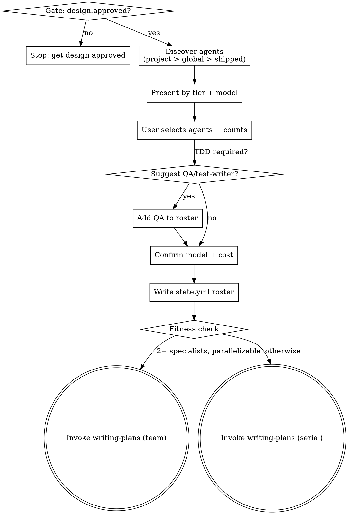

# Composing Teams

## Overview

Discover, present, and let the user select agent definitions for team composition. Creates a team roster that downstream skills (writing-plans, agent-team-driven-development, subagent-driven-development) use for spawning specialists.

**Announce at start:** "I'm using the composing-teams skill to assemble your development team."

## Verification Gate

Before starting, confirm:
1. `.superpowers/state.yml` exists and `design.approved == true`
2. `worktree.main.path` is accessible

If design is not approved: "The design doc has not been approved. Please complete `superpowers:brainstorming` and get design approval before composing a team."

## When to Compose a Team

Compose a team when the design meets all three criteria:
- 4+ distinct tasks in the design
- 2+ tasks are independent (can run in parallel)
- 2+ distinct specialist domains required (e.g., frontend + backend, or implementation + QA)

If the design doesn't meet these criteria, skip to `superpowers:writing-plans` directly.

## Process



### Step 1: Discover Available Agents

**Agent selection hierarchy** — always prefer more specific over generic:

| Tier | Location | Priority | Use when |
|------|----------|----------|----------|
| Project agents | `.claude/agents/` | Highest | Project-specific expertise, always preferred |
| Global agents | `~/.claude/agents/` | Second | Personal cross-project specialists |
| Shipped defaults | Superpowers `agents/` | Fallback | No project/global agent for that role |
| Raw model tiers | No agent file | Last resort | No matching agent exists at all |

Deduplicate by name: project overrides global overrides shipped.

Parse each agent's YAML frontmatter for: `name`, `description`, `model`, `tools`.

**If no suitable project agent exists:** Suggest creating one from a shipped template. For example: "There's no project-specific `react-engineer` agent. Would you like me to create `.claude/agents/react-engineer.md` from the shipped `implementer` template? You can customize it for your stack."

### Step 2: Present by Tier

Group discovered agents into tiers based on their configuration:

| Tier | Criteria | Default model | Examples |
|------|----------|---------------|---------|
| Leadership | opus model + broad tools (incl. Task/WebSearch) | opus | project-lead, principal-architect |
| Engineers | Full tools (Read/Write/Edit/Bash) | sonnet | frontend-engineer, backend-engineer |
| Specialists | Full tools, cross-cutting domain | sonnet | database, devops, llm-integration |
| Reviewers | Restricted tools (Read-only, no Write/Edit) | opus | architecture-reviewer, security-reviewer |
| QA / Test-writer | Full tools, testing focus | sonnet | qa-engineer, qa-integration |

**Model tiering guidance:**
- Planning, architecture, cross-cutting review → opus (high reasoning demand)
- Implementation, test-writing → sonnet (fast iteration, sufficient quality)
- Quick mechanical tasks (rename, format, lint-fix) → haiku (low cost)

**Cost implications:** Multiple opus agents multiply cost rapidly. A team of 3 opus implementers costs ~3x a single opus session. Consider sonnet for implementation agents unless the task has high ambiguity or requires design judgment. Inform the user of the model breakdown before finalizing.

Present each agent with: name, description, model, tool restrictions.

### Step 3: Compose Team

Ask the user:
1. Which agents to include in the team
2. How many of each (e.g., 2x frontend-engineer, 1x backend-engineer)
3. Whether to create any new agent definitions on the fly

**Team sizing rationale:**
- Maximum 3 simultaneous implementers. Beyond 3, context overhead for the lead and merge complexity outweigh parallelism gains.
- A QA/test-writer agent does not count toward the 3-implementer limit — their work is sequential within each wave (writing tests, not running parallel with implementers).
- 1-2 implementers + 1 QA is often more effective than 3 implementers with no QA.

**Test-writer / QA role:**
When the design includes a test phase or TDD is required, recommend adding a QA/test-writer to the roster. This enables pipelined TDD (see `superpowers:test-driven-development`):
- Wave 0: QA writes failing tests for Wave 1 tasks
- Wave N: Implementers pass tests; QA writes tests for Wave N+1

Suggest the shipped `qa-engineer` agent or a project-specific QA agent if one exists.

**Model policy:**
- If an agent definition specifies a model → use that model
- If no model or `model: inherit` → apply model tiering defaults (see Step 2 table)
- Show the model for every roster entry before asking for confirmation

### Step 4: Output Team Roster and Write State

Present the confirmed roster to the user, then write it to `.superpowers/state.yml`:

```yaml
phase: composing
team:
  name: <project>-team
  roster:
    - role: react-engineer
      agent: react-engineer       # project agent (highest priority)
      model: sonnet
    - role: backend-engineer
      agent: implementer          # shipped fallback
      model: sonnet
    - role: qa-engineer
      agent: qa-engineer          # shipped fallback
      model: sonnet
    - role: architect-reviewer
      agent: code-reviewer        # shipped fallback
      model: opus
```

Also show a human-readable summary table:

| Role | Agent Definition | Model | Tier |
|------|-----------------|-------|------|
| [instance-name] | [agent-name] | [model] | [tier] |

### Step 5: Route to Planning

Apply fitness check:
- Roster has 2+ distinct specialist roles AND work has parallelizable components → recommend team plan format during writing-plans
- Otherwise → recommend standard serial format

Either way, invoke `writing-plans` next. The unified writing-plans skill handles both formats based on a Team Fitness Check.

## Key Principles

- **Discover, don't assume** — Always scan for available agents rather than hardcoding roles
- **User chooses** — Present options but let the user decide team composition
- **Right-size the team** — Max 3 simultaneous implementers; more hits diminishing returns
- **Respect definitions** — Use agents as defined; don't override model/tools without asking
- **Worktrees are mandatory for teams** — Each team agent works in an isolated worktree

## Integration

**Before this skill:**
- **superpowers:brainstorming** — Design approved, worktree created

**After this skill:**
- **superpowers:writing-plans** — Creates the implementation plan using the team roster

## References

For users who want more specialized agents:
- [VoltAgent/awesome-claude-code-subagents](https://github.com/VoltAgent/awesome-claude-code-subagents) — 127+ specialized Claude Code subagents
- [Claude Code subagent docs](https://code.claude.com/docs/en/sub-agents) — Official agent definition format
- [Claude Code agent teams docs](https://code.claude.com/docs/en/agent-teams) — Official team orchestration guide
