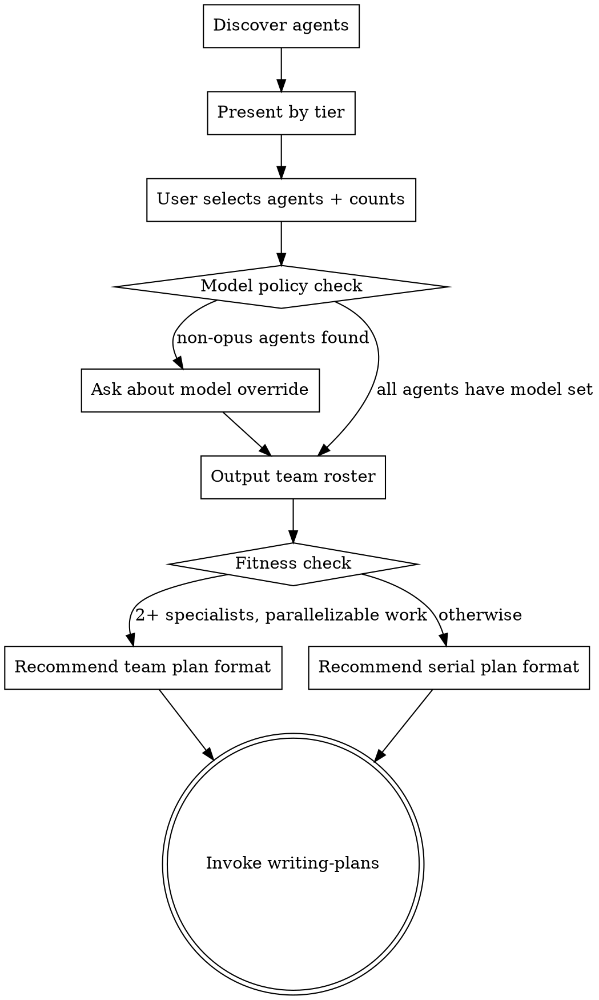

# Composing Teams

## Overview

Discover, present, and let the user select agent definitions for team composition. Creates a team roster that downstream skills (writing-plans, agent-team-driven-development, subagent-driven-development) use for spawning specialists.

**Announce at start:** "I'm using the composing-teams skill to assemble your development team."

## Process

### Step 1: Discover Available Agents

Scan for agent `.md` files in order of priority:

1. `.claude/agents/` (project-level, highest priority)
2. `~/.claude/agents/` (global/personal)
3. Superpowers `agents/` directory (shipped defaults, lowest priority)

Deduplicate by name: project overrides global overrides shipped.

Parse each agent's YAML frontmatter for: `name`, `description`, `model`, `tools`.

### Step 2: Present by Tier

Group discovered agents into tiers based on their configuration:

| Tier | Criteria | Examples |
|------|----------|---------|
| Leadership | opus model + broad tools (incl. Task/WebSearch) | project-lead, principal-architect |
| Engineers | Full tools (Read/Write/Edit/Bash) | frontend-engineer, backend-engineer |
| Specialists | Full tools, cross-cutting domain | database, devops, llm-integration |
| Reviewers | Restricted tools (Read-only, no Write/Edit) | architecture-reviewer, security-reviewer |
| QA | Full tools, testing focus | qa-engineer, qa-integration |

Present each agent with: name, description, model, tool restrictions.

### Step 3: Compose Team

Ask the user:
1. Which agents to include in the team
2. How many of each (e.g., 2x frontend-engineer, 1x backend-engineer)
3. Whether to create any new agent definitions on the fly

**Model policy:**
- If an agent definition specifies a model → use that model
- If no model or `model: inherit` → use the most powerful available model
- Note any agents without explicit model and inform the user

### Step 4: Output Team Roster

Add the team roster to the design doc:

| Role | Agent Definition | Count | Model | Tier |
|------|-----------------|-------|-------|------|
| [instance-name] | [agent-name] | [count] | [model] | [tier] |

### Step 5: Route to Planning

Apply fitness check:
- Roster has 2+ distinct specialist roles AND work has parallelizable components → recommend team plan format during writing-plans
- Otherwise → recommend standard serial format

Either way, invoke `writing-plans` next. The unified writing-plans skill handles both formats based on a Team Fitness Check.

## Key Principles

- **Discover, don't assume** — Always scan for available agents rather than hardcoding roles
- **User chooses** — Present options but let the user decide team composition
- **Right-size the team** — Max 3 simultaneous implementers; more hits diminishing returns
- **Respect definitions** — Use agents as defined; don't override model/tools without asking
- **Worktrees are mandatory for teams** — Each team agent works in an isolated worktree

## Integration

**Before this skill:**
- **superpowers:brainstorming** — Design approved, worktree created

**After this skill:**
- **superpowers:writing-plans** — Creates the implementation plan using the team roster

## References

For users who want more specialized agents:
- [VoltAgent/awesome-claude-code-subagents](https://github.com/VoltAgent/awesome-claude-code-subagents) — 127+ specialized Claude Code subagents
- [Claude Code subagent docs](https://code.claude.com/docs/en/sub-agents) — Official agent definition format
- [Claude Code agent teams docs](https://code.claude.com/docs/en/agent-teams) — Official team orchestration guide
