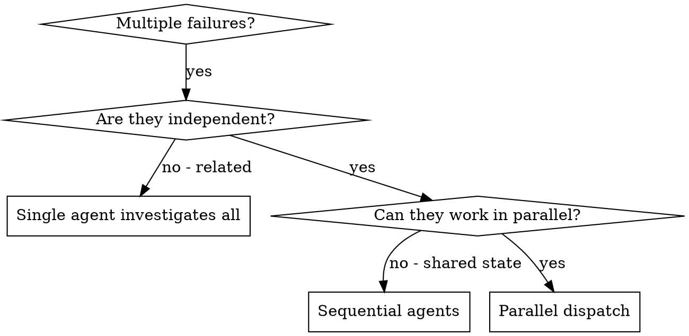

# Dispatching Parallel Agents

## Overview

When you have multiple unrelated failures (different test files, different subsystems, different bugs), investigating them sequentially wastes time. Each investigation is independent and can happen in parallel.

**Core principle:** Dispatch one agent per independent problem domain. Let them work concurrently.

## Scope Boundary

This skill is for **ad-hoc parallel dispatch** — you spot N independent problems right now and want them solved simultaneously.

For **planned parallel execution** across structured waves with team specialists, use `superpowers:agent-team-driven-development` instead. That skill handles wave sequencing, worktree lifecycle, and team rosters.

| Use this skill | Use agent-team-driven-development |
|---|---|
| Ad-hoc: 2+ unrelated failures you just found | Planned: 4+ tasks designed for parallel work |
| Short-lived agents (single problem) | Persistent specialists (multi-wave) |
| No team roster needed | Team roster and role assignments |

## When to Use



**Use when:**
- 2+ test files failing with different root causes
- Multiple subsystems broken independently
- Each problem can be understood without context from others
- No shared state between investigations

**Don't use when:**
- Failures are related (fix one might fix others)
- Need to understand full system state
- Agents would interfere with each other

## The Pattern

### 1. Identify Independent Domains

Group failures by what's broken:
- File A tests: Tool approval flow
- File B tests: Batch completion behavior
- File C tests: Abort functionality

Each domain is independent — fixing tool approval doesn't affect abort tests.

### 2. Create Focused Agent Tasks

Each agent gets:
- **Specific scope:** One test file or subsystem
- **Clear goal:** Make these tests pass
- **Constraints:** Don't change other code
- **Expected output:** Summary of what you found and fixed

### 3. Configure Agent Permissions and Isolation

Spawned agents need permission to act autonomously. Use `mode: "bypassPermissions"` so agents don't stall waiting for approval on every tool call.

For file isolation, give each agent its own worktree. This prevents agents from overwriting each other's changes to shared files.

**Claude Code:** Use `isolation: "worktree"` on the Agent tool — worktrees are created automatically.

**Cursor / Codex / other platforms:** Create worktrees manually before dispatching:

```bash
git worktree add .worktrees/agent-1 -b agent-1-fix
git worktree add .worktrees/agent-2 -b agent-2-fix
```

```javascript
// Claude Code Agent tool — correct syntax
Agent({
  prompt: "Fix agent-tool-abort.test.ts failures. ...",
  mode: "bypassPermissions",
  isolation: "worktree"
})
```

**Model tier guidance:** Use `haiku` for narrow, well-defined tasks (fix one failing test). Use `sonnet` (default) for tasks requiring judgment. Reserve `opus` for tasks with high ambiguity or cross-cutting impact.

### 4. Dispatch in Parallel

Call agents in the same response without awaiting between them — they run concurrently:

```javascript
// All three dispatch simultaneously (Claude Code syntax)
Agent({ prompt: "Fix agent-tool-abort.test.ts failures...", mode: "bypassPermissions", isolation: "worktree" })
Agent({ prompt: "Fix batch-completion-behavior.test.ts failures...", mode: "bypassPermissions", isolation: "worktree" })
Agent({ prompt: "Fix tool-approval-race-conditions.test.ts failures...", mode: "bypassPermissions", isolation: "worktree" })
```

### 5. Review and Integrate

When agents return:
- Read each summary
- Run `git diff <branch-a> <branch-b>` to detect conflicts between agent branches
- Verify fixes don't conflict by checking overlapping files: `git diff --name-only <agent-branch>`
- Run full test suite on merged result
- Integrate all changes

**Conflict resolution:** If two agents modified the same file, review both diffs, merge manually, re-run tests.

## Agent Prompt Structure

Good agent prompts are:
1. **Focused** — One clear problem domain
2. **Self-contained** — All context needed to understand the problem
3. **Specific about output** — What should the agent return?

```markdown
Fix the 3 failing tests in src/agents/agent-tool-abort.test.ts:

1. "should abort tool with partial output capture" - expects 'interrupted at' in message
2. "should handle mixed completed and aborted tools" - fast tool aborted instead of completed
3. "should properly track pendingToolCount" - expects 3 results but gets 0

These are timing/race condition issues. Your task:

1. Read the test file and understand what each test verifies
2. Identify root cause - timing issues or actual bugs?
3. Fix by:
   - Replacing arbitrary timeouts with event-based waiting
   - Fixing bugs in abort implementation if found
   - Adjusting test expectations if testing changed behavior

Do NOT just increase timeouts - find the real issue.

Return: Summary of what you found and what you fixed.
```

## Common Mistakes

Too broad: "Fix all the tests" — agent gets lost
Specific: "Fix agent-tool-abort.test.ts" — focused scope

No context: "Fix the race condition" — agent doesn't know where
Context: Paste the error messages and test names

No constraints: Agent might refactor everything
Constraints: "Do NOT change production code" or "Fix tests only"

Vague output: "Fix it" — you don't know what changed
Specific: "Return summary of root cause and changes"

Missing permissions: Agent stalls on every tool approval
Set `mode: "bypassPermissions"` so agent can act autonomously

No isolation: Agents overwrite each other's changes
Use worktree isolation for file-safe parallel work

## When NOT to Use

**Related failures:** Fixing one might fix others — investigate together first
**Need full context:** Understanding requires seeing entire system
**Exploratory debugging:** You don't know what's broken yet
**Shared state:** Agents would interfere (editing same files, using same resources)

## Real Example from Session

**Scenario:** 6 test failures across 3 files after major refactoring

**Failures:**
- agent-tool-abort.test.ts: 3 failures (timing issues)
- batch-completion-behavior.test.ts: 2 failures (tools not executing)
- tool-approval-race-conditions.test.ts: 1 failure (execution count = 0)

**Decision:** Independent domains — abort logic separate from batch completion separate from race conditions

**Dispatch:**
```
Agent 1 → Fix agent-tool-abort.test.ts
Agent 2 → Fix batch-completion-behavior.test.ts
Agent 3 → Fix tool-approval-race-conditions.test.ts
```

**Results:**
- Agent 1: Replaced timeouts with event-based waiting
- Agent 2: Fixed event structure bug (threadId in wrong place)
- Agent 3: Added wait for async tool execution to complete

**Integration:** All fixes independent, no conflicts, full suite green

**Time saved:** 3 problems solved in parallel vs sequentially

## Key Benefits

1. **Parallelization** — Multiple investigations happen simultaneously
2. **Focus** — Each agent has narrow scope, less context to track
3. **Independence** — Agents don't interfere with each other
4. **Speed** — 3 problems solved in time of 1

## Verification

After agents return:
1. **Review each summary** — Understand what changed
2. **Check for conflicts** — `git diff <branch-a> <branch-b>` between agent branches
3. **Run full suite** — Verify all fixes work together
4. **Spot check** — Agents can make systematic errors

## Real-World Impact

From debugging session (2025-10-03):
- 6 failures across 3 files
- 3 agents dispatched in parallel
- All investigations completed concurrently
- All fixes integrated successfully
- Zero conflicts between agent changes
