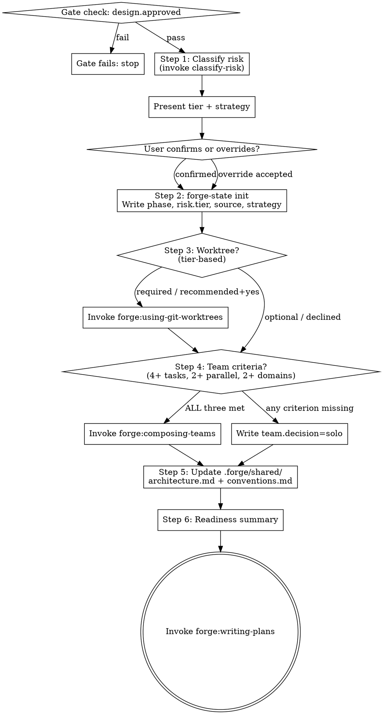

# Setting Up a Project

## Overview

Bridge between an approved design and execution. Classifies risk, initializes state, sets up the workspace, and decides whether to run solo or as a team — so that `forge:writing-plans` can start from a clean, known configuration.

**Announce at start:** "I'm using the setting-up-project skill to prepare the workspace before writing plans."

<HARD-GATE>
Do NOT invoke `forge:writing-plans` until all six steps in this skill are complete.
</HARD-GATE>


## Verification Gate

Before starting, check the design gate:

```
forge-gate check design.approved --project-dir .
```

If the gate fails (exit code != 0):
- Stop immediately.
- Report: "design.approved gate failed — complete `forge:brainstorming` and get design approval before running setting-up-project."
- Do NOT proceed until the gate passes.


## Step 1 — Classify Risk

Invoke `classify-risk` to determine the risk tier for this project:

```
classify-risk <files-or-dirs-affected> --scope <task-count>
```

`classify-risk` reads `.forge/policies/` and returns one of: `minimal`, `standard`, `elevated`, `critical`.

Present the result to the user:

```
Risk classification result:
  Tier:      <tier>
  Source:    <policy|inferred>
  Strategy:  <solo|team-optional|team-recommended|team-required>

Risk tier determines: ceremony level, worktree requirement, team requirement.
```

Ask: "Does this classification look correct, or would you like to override it?"

Accept override if provided. Record the source as `override` if changed.

**Tier → execution strategy mapping:**

| Tier | Execution Strategy |
|------|--------------------|
| minimal | solo |
| standard | team-optional |
| elevated | team-recommended |
| critical | team-required |


## Step 2 — Initialize State

Run `forge-state init` to create the local state store for this project:

```
forge-state init --project-dir .
```

Then write the project phase and risk classification to state:

```
forge-state set phase setting-up --project-dir .
forge-state set risk.tier <tier> --project-dir .
forge-state set risk.source <policy|inferred|override> --project-dir .
forge-state set risk.execution_strategy <strategy> --project-dir .
```

State is stored in `.forge/local/` which is gitignored. It persists across sessions within the same working directory.


## Step 3 — Worktree Setup

Create an isolated worktree based on the risk tier.

**Worktree requirement by tier:**

| Tier | Worktree |
|------|----------|
| minimal | Optional |
| standard | Recommended |
| elevated | Required |
| critical | Required |

For **Required** tiers: create the worktree now via `forge:using-git-worktrees`. Do not skip.

For **Recommended** tiers: ask the user:
> "Standard tier projects benefit from an isolated worktree. Create one now? (Recommended)"

For **Optional** tiers: offer the option, but proceed without if the user declines.

After worktree creation, `forge:using-git-worktrees` writes `worktree.main.path` to state. Verify the path is accessible before continuing.


## Step 4 — Team Decision

Evaluate whether this project warrants a team. Apply the structured decision framework — do NOT compose a team based on intuition.

| Criterion | Threshold | Met? |
|-----------|-----------|------|
| Task count | 4+ distinct tasks | |
| Independence | 2+ tasks can run in parallel | |
| Specialist domains | 2+ distinct areas of expertise | |

**Compose a team ONLY if ALL three criteria are met.** Otherwise proceed solo.

To evaluate, scan the design doc for task decomposition. If unclear, count the top-level implementation steps.

**If composing a team:** invoke `forge:composing-teams`. Do not design the roster yourself.

**If going solo:** skip composing-teams entirely.

Write the team decision to state:

```
forge-state set team.decision <solo|team> --project-dir .
```


## Step 5 — Update Shared Docs

Update the shared documentation that downstream agents and implementers will reference.

Ensure these files exist in `.forge/shared/`:

**`.forge/shared/architecture.md`** — high-level system structure from the design:
- Project name and goal (one sentence)
- Key components and their responsibilities
- External dependencies
- Public interfaces that implementers must not break

**`.forge/shared/conventions.md`** — coding and workflow standards:
- Language/stack in use
- File naming and directory conventions
- Testing approach (TDD, pipelined TDD, etc.)
- Commit message format
- Any project-specific rules from `CLAUDE.md`

If these files already exist (re-run or re-adoption), update them in place. Do not lose existing content without reading it first.


## Step 6 — Readiness Summary

Present a summary before handing off to writing-plans:

```
Project setup complete:

  Risk tier:  <tier>  (<source>)
  Worktree:   <path | not created>
  Team:       <solo | team — N agents>
  Phase:      setting-up → planning (next)

Shared docs updated:
  .forge/shared/architecture.md
  .forge/shared/conventions.md

Ready to write implementation plans.
```

Ask: "Shall I proceed to `forge:writing-plans`?"

On user confirmation, invoke `forge:writing-plans`.


## Process Flow




## State Written by This Skill

```yaml
phase: setting-up
risk:
  tier: <minimal|standard|elevated|critical>
  source: <policy|inferred|override>
  execution_strategy: <solo|team-optional|team-recommended|team-required>
worktree:
  main:
    path: <path>          # written by forge:using-git-worktrees
team:
  decision: <solo|team>
```

All state is stored in `.forge/local/` (gitignored).


## Integration

**Before this skill:**
- `forge:brainstorming` — design doc written, `design.approved: true` in state

**After this skill:**
- `forge:writing-plans` — receives initialized state with risk tier, worktree path, and team decision

**Delegates to:**
- `classify-risk` — risk tier determination (do not re-implement)
- `forge:using-git-worktrees` — worktree creation (do not re-implement)
- `forge:composing-teams` — team roster (do not re-implement)

**Reads from state:** `design.approved`
**Writes to state:** `phase`, `risk.tier`, `risk.source`, `risk.execution_strategy`, `team.decision`
