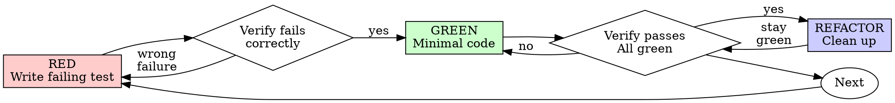
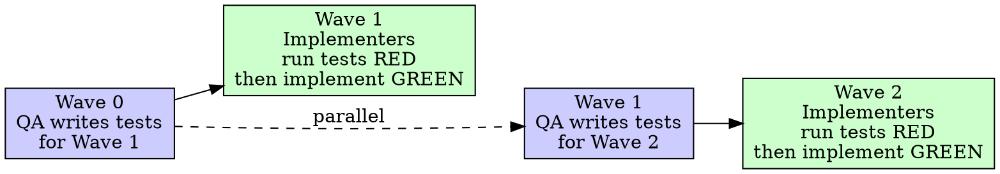

# Test-Driven Development (TDD)

## Overview

Write the test first. Watch it fail. Write minimal code to pass.

**Core principle:** If you didn't watch the test fail, you don't know if it tests the right thing.

**Violating the letter of the rules is violating the spirit of the rules.**

## When to Use

**Always:**
- New features
- Bug fixes
- Refactoring
- Behavior changes

**Exceptions (ask the user):**
- Throwaway prototypes
- Generated code
- Configuration files

Thinking "skip TDD just this once"? Stop. That's rationalization.

## The Iron Law

```
NO PRODUCTION CODE WITHOUT A FAILING TEST FIRST
```

Write code before the test? Delete it and start over — unless you've spent significant time (see graduated response below).

**No exceptions:**
- Don't keep it as "reference"
- Don't "adapt" it while writing tests
- Don't look at it
- Delete means delete

Implement fresh from tests. Period.

**Graduated response for large work:**
- Under ~1 hour: delete without question
- 1-3+ hours: pause, consult the user — explain what happened and get agreement before deleting or recovering
- This isn't an excuse to avoid TDD; it's recognition that humans make judgment calls on large sunk costs

## Red-Green-Refactor



### RED - Write Failing Test

Write one minimal test showing what should happen.

<Good>
```typescript
test('retries failed operations 3 times', async () => {
  let attempts = 0;
  const operation = () => {
    attempts++;
    if (attempts < 3) throw new Error('fail');
    return 'success';
  };

  const result = await retryOperation(operation);

  expect(result).toBe('success');
  expect(attempts).toBe(3);
});
```
Clear name, tests real behavior, one thing
</Good>

<Bad>
```typescript
test('retry works', async () => {
  const mock = jest.fn()
    .mockRejectedValueOnce(new Error())
    .mockRejectedValueOnce(new Error())
    .mockResolvedValueOnce('success');
  await retryOperation(mock);
  expect(mock).toHaveBeenCalledTimes(3);
});
```
Vague name, tests mock not code
</Bad>

**Requirements:**
- One behavior
- Clear name
- Real code (no mocks unless unavoidable)

### Verify RED - Watch It Fail

**MANDATORY. Never skip.**

Run your test suite with the appropriate command:

```bash
# JavaScript / TypeScript
npm test path/to/test.test.ts
# or: npx jest path/to/test.test.ts

# Python
pytest tests/test_feature.py -v

# Rust
cargo test test_name

# Go
go test ./... -run TestFeatureName

# Ruby
bundle exec rspec spec/feature_spec.rb
```

Confirm:
- Test fails (not errors)
- Failure message is expected
- Fails because feature missing (not typos)

**Test passes?** You're testing existing behavior. Fix test.

**Test errors?** Fix error, re-run until it fails correctly.

### GREEN - Minimal Code

Write simplest code to pass the test.

<Good>
```typescript
async function retryOperation<T>(fn: () => Promise<T>): Promise<T> {
  for (let i = 0; i < 3; i++) {
    try {
      return await fn();
    } catch (e) {
      if (i === 2) throw e;
    }
  }
  throw new Error('unreachable');
}
```
Just enough to pass
</Good>

<Bad>
```typescript
async function retryOperation<T>(
  fn: () => Promise<T>,
  options?: {
    maxRetries?: number;
    backoff?: 'linear' | 'exponential';
    onRetry?: (attempt: number) => void;
  }
): Promise<T> {
  // YAGNI
}
```
Over-engineered
</Bad>

Don't add features, refactor other code, or "improve" beyond the test.

### Verify GREEN - Watch It Pass

**MANDATORY.**

Run the same command used in Verify RED.

Confirm:
- Test passes
- Other tests still pass
- Output pristine (no errors, warnings)

**Test fails?** Fix code, not test.

**Other tests fail?** Fix now.

### REFACTOR - Clean Up

After green only. Common refactors:

| Smell | Refactor |
|---|---|
| Duplicated logic in multiple tests | Extract shared setup or factory helper |
| Function doing too many things | Extract sub-functions with descriptive names |
| Magic numbers/strings in test | Name the constants |
| Method name too generic | Rename to reflect intent (`process()` → `validateAndEnqueue()`) |
| Long parameter list | Group into options object |

Keep tests green throughout. Run tests after each refactor step.

Don't add behavior. If you think of a new edge case, add a new failing test first (RED), then implement.

### Repeat

Next failing test for next feature.

## Good Tests

| Quality | Good | Bad |
|---------|------|-----|
| **Minimal** | One thing. "and" in name? Split it. | `test('validates email and domain and whitespace')` |
| **Clear** | Name describes behavior | `test('test1')` |
| **Shows intent** | Demonstrates desired API | Obscures what code should do |

## Why Order Matters

**"I'll write tests after to verify it works"**

Tests written after code pass immediately. Passing immediately proves nothing:
- Might test wrong thing
- Might test implementation, not behavior
- Might miss edge cases you forgot
- You never saw it catch the bug

Test-first forces you to see the test fail, proving it actually tests something.

**"I already manually tested all the edge cases"**

Manual testing is ad-hoc. You think you tested everything but:
- No record of what you tested
- Can't re-run when code changes
- Easy to forget cases under pressure
- "It worked when I tried it" ≠ comprehensive

Automated tests are systematic. They run the same way every time.

**"Deleting X hours of work is wasteful"**

Sunk cost fallacy. The time is already gone. Your choice now:
- Delete and rewrite with TDD (X more hours, high confidence)
- Keep it and add tests after (30 min, low confidence, likely bugs)

The "waste" is keeping code you can't trust. Working code without real tests is technical debt.

**"TDD is dogmatic, being pragmatic means adapting"**

TDD IS pragmatic:
- Finds bugs before commit (faster than debugging after)
- Prevents regressions (tests catch breaks immediately)
- Documents behavior (tests show how to use code)
- Enables refactoring (change freely, tests catch breaks)

"Pragmatic" shortcuts = debugging in production = slower.

**"Tests after achieve the same goals - it's spirit not ritual"**

No. Tests-after answer "What does this do?" Tests-first answer "What should this do?"

Tests-after are biased by your implementation. You test what you built, not what's required. You verify remembered edge cases, not discovered ones.

Tests-first force edge case discovery before implementing. Tests-after verify you remembered everything (you didn't).

30 minutes of tests after ≠ TDD. You get coverage, lose proof tests work.

## Common Rationalizations

| Excuse | Reality |
|--------|---------|
| "Too simple to test" | Simple code breaks. Test takes 30 seconds. |
| "I'll test after" | Tests passing immediately prove nothing. |
| "Tests after achieve same goals" | Tests-after = "what does this do?" Tests-first = "what should this do?" |
| "Already manually tested" | Ad-hoc ≠ systematic. No record, can't re-run. |
| "Deleting X hours is wasteful" | Under 1hr: delete without question. Longer: consult the user before deciding. |
| "Keep as reference, write tests first" | You'll adapt it. That's testing after. Delete means delete. |
| "Need to explore first" | Fine. Throw away exploration, start with TDD. |
| "Test hard = design unclear" | Listen to test. Hard to test = hard to use. |
| "TDD will slow me down" | TDD faster than debugging. Pragmatic = test-first. |
| "Manual test faster" | Manual doesn't prove edge cases. You'll re-test every change. |
| "Existing code has no tests" | You're improving it. Add tests for existing code. |

## Red Flags - STOP and Start Over

- Code before test
- Test after implementation
- Test passes immediately
- Can't explain why test failed
- Tests added "later"
- Rationalizing "just this once"
- "I already manually tested it"
- "Tests after achieve the same purpose"
- "It's about spirit not ritual"
- "Keep as reference" or "adapt existing code"
- "Already spent significant hours, deleting is wasteful" (under 1hr: delete; longer: consult the user)
- "TDD is dogmatic, I'm being pragmatic"
- "This is different because..."

**All of these mean: Delete code. Start over with TDD.** (For significant multi-hour work: consult the user first.)

## Example: Bug Fix

**Bug:** Empty email accepted

**RED**
```typescript
test('rejects empty email', async () => {
  const result = await submitForm({ email: '' });
  expect(result.error).toBe('Email required');
});
```

**Verify RED**
```bash
$ npm test
FAIL: expected 'Email required', got undefined
```

**GREEN**
```typescript
function submitForm(data: FormData) {
  if (!data.email?.trim()) {
    return { error: 'Email required' };
  }
  // ...
}
```

**Verify GREEN**
```bash
$ npm test
PASS
```

**REFACTOR**
Extract validation for multiple fields if needed.

## Verification Checklist

Before marking work complete:

- [ ] Every new function/method has a test
- [ ] Watched each test fail before implementing
- [ ] Each test failed for expected reason (feature missing, not typo)
- [ ] Wrote minimal code to pass each test
- [ ] All tests pass
- [ ] Output pristine (no errors, warnings)
- [ ] Tests use real code (mocks only if unavoidable)
- [ ] Edge cases and errors covered

Can't check all boxes? You skipped TDD. Start over.

## When Stuck

| Problem | Solution |
|---------|----------|
| Don't know how to test | Write wished-for API. Write assertion first. Ask the user. |
| Test too complicated | Design too complicated. Simplify interface. |
| Must mock everything | Code too coupled. Use dependency injection. |
| Test setup huge | Extract helpers. Still complex? Simplify design. |

## Debugging Integration

Bug found? Write failing test reproducing it. Follow TDD cycle. Test proves fix and prevents regression.

Never fix bugs without a test.

## Two TDD Modes

TDD works in two configurations depending on whether you are working solo or in an agent team.

| Mode | Who writes tests | Who implements | When |
|---|---|---|---|
| **Solo TDD** | Same agent | Same agent | Single-agent execution (executing-plans, subagent-driven) |
| **Pipelined TDD** | QA agent (one wave ahead) | Implementer agents | Team execution (agent-team-driven) |

### Solo TDD

Standard Red-Green-Refactor as described above. One agent writes the failing test, watches it fail, implements, watches it pass.

### Pipelined TDD

QA agents write tests one wave ahead of implementers.



**QA agent responsibilities:**
- Write tests in the lead's worktree (not implementer worktrees — avoids merge conflicts)
- Write tests that fail for the right reason against the current codebase
- Hand off test files to implementers with the wave assignment

**Implementer responsibilities in pipelined mode:**
- Run QA's tests first — confirm RED
- Implement until GREEN
- Provide RED evidence + GREEN evidence in completion report

Pipelined TDD only activates when a QA agent is in the team roster.

## Plan-Level Test Expectations

When plans are created with `superpowers:writing-plans`, each task must include test expectations. This makes TDD impossible to skip — implementers know exactly what to verify before starting.

**Required per task (3-5 lines):**
```markdown
## Test Expectations
- Test: <what to test — one behavior per test>
- Expected red failure: <exact failure message or assertion that fails>
- Expected green: <what passes after minimal implementation>
```

**Example:**
```markdown
## Test Expectations
- Test: `POST /api/users` with valid payload returns 201 + user object
- Expected red failure: `TypeError: Cannot read properties of undefined (reading 'create')` (route not implemented)
- Expected green: `{"id": "uuid", "email": "test@example.com"}` with status 201
```

If a task's test expectations are missing or vague, implementers must clarify with the plan author before starting.

## Execution-Level Evidence

Before marking any implementation task complete, you must provide:

**RED evidence** — proof the test failed for the right reason:
```
Command: npm test src/api/users.test.ts
Exit code: 1
Output (last 20 lines):
  FAIL src/api/users.test.ts
  ● POST /api/users › returns 201 with user object
    TypeError: Cannot read properties of undefined (reading 'create')
      at Object.<anonymous> (src/api/users.test.ts:14:5)
```

**GREEN evidence** — proof the test passes after implementation:
```
Command: npm test src/api/users.test.ts
Exit code: 0
Output:
  PASS src/api/users.test.ts
  ✓ POST /api/users returns 201 with user object (23ms)
  Test Suites: 1 passed, 1 total
```

Any completion report missing RED + GREEN evidence is rejected. See `superpowers:verification-before-completion` for the canonical evidence format used across all execution skills.

## Testing Anti-Patterns

When adding mocks or test utilities, read `skills/test-driven-development/testing-anti-patterns.md` to avoid common pitfalls:
- Testing mock behavior instead of real behavior
- Adding test-only methods to production classes
- Mocking without understanding dependencies

## Final Rule

```
Production code → test exists and failed first
Otherwise → not TDD
```

No exceptions without the user's permission.
