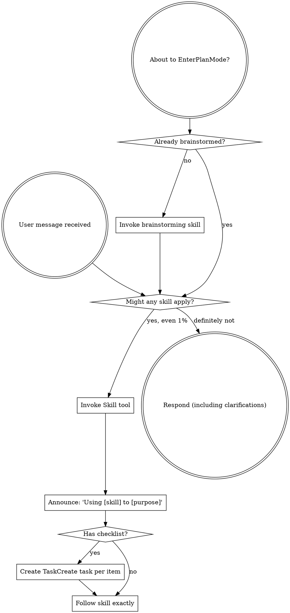

**The Rule:** Invoke relevant skills BEFORE any response or action. If you think there is even a 1% chance a skill applies, invoke it first. If an invoked skill turns out not to fit, you don't need to follow it.

**Stuck-state check:** If you notice you have been responding without invoking any skills across multiple turns, stop. Read this skill again. You may have drifted into bypassing the skill framework.

## How to Access Skills

**In Claude Code:** Use the `Skill` tool. When you invoke a skill, its content is loaded and presented to you—follow it directly. Never use the Read tool on skill files.

**In other environments:** Check your platform's documentation for how skills are loaded.

# Using Skills

## The Rule

**Invoke relevant or requested skills BEFORE any response or action.** Even a 1% chance a skill might apply means that you should invoke the skill to check. If an invoked skill turns out to be wrong for the situation, you don't need to use it.

## Red Flags

These thoughts mean STOP — you're rationalizing:

| Thought | Reality |
|---------|---------|
| "This is just a simple question" | Questions are tasks. Check for skills first. |
| "I need more context first" | Skill check comes BEFORE clarifying questions. |
| "I remember this skill" | Skills evolve. Read current version, don't recall. |
| "This doesn't need a formal skill" | If a skill exists, use it. |
| "I'll just do this one thing first" | Check BEFORE doing anything. |

## Skill Priority

When multiple skills could apply, use this order:

1. **Process skills first** (brainstorming, debugging) - these determine HOW to approach the task
2. **Implementation skills second** (frontend-design, mcp-builder) - these guide execution

"Let's build X" → brainstorming first, then implementation skills.
"Fix this bug" → debugging first, then domain-specific skills.

## Skill Types

**Rigid** (TDD, debugging): Follow exactly. Don't adapt away discipline.

**Flexible** (patterns): Adapt principles to context.

The skill itself tells you which.

## Team-Aware Skills

Superpowers supports multi-agent team execution for parallelizable work:

- **composing-teams** — Discovers available agent definitions, lets you select specialists and team size
- **agent-team-driven-development** — Orchestrates persistent specialist agents working in parallel across waves
- **writing-plans** — Creates implementation plans with optional wave analysis for team execution

Agent teams are experimental and require the `CLAUDE_CODE_EXPERIMENTAL_AGENT_TEAMS` setting. See [Claude Code agent teams docs](https://code.claude.com/docs/en/agent-teams) for setup.

## Subagent Context

Subagents spawned via the Agent tool do **not** automatically receive the skill framework. They start without `using-superpowers` loaded and may not invoke skills.

To give spawned agents skill awareness:
- Use project agents (`.claude/agents/`) that embed skill invocations in their system prompts
- Or pass explicit skill names in the agent prompt: "Use `superpowers:test-driven-development` for all implementation tasks"
- Or use `subagent_type` matching a skill-aware agent definition

Raw subagents with no agent type receive no skill framework and should be treated accordingly.

## User Instructions

Instructions say WHAT, not HOW. "Add X" or "Fix Y" doesn't mean skip workflows.
