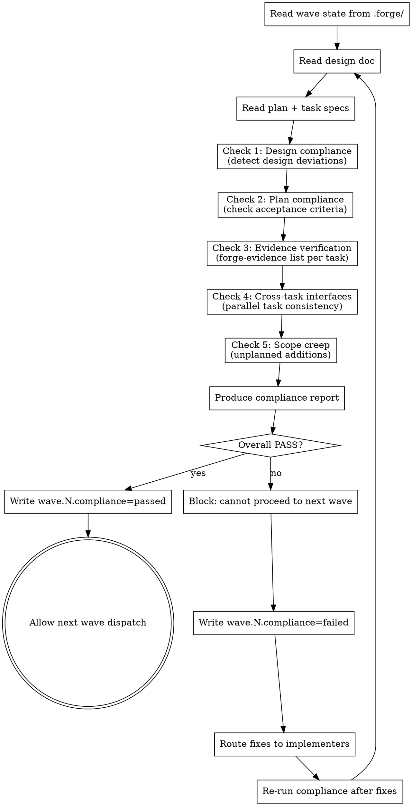

# Validating Wave Compliance

## Overview

Between-wave gate. After each wave completes and per-task reviews pass, this skill validates that the wave as a whole conforms to the design doc and plan — catching deviations, missing evidence, and cross-task inconsistencies before they compound into the next wave.

**Announce at start:** "I'm using the validating-wave-compliance skill to check wave N against the design and plan."

<HARD-GATE>
Do NOT allow the next wave to start until this skill completes with a PASS verdict. A failed wave compliance check blocks all wave progression until deviations are resolved.
</HARD-GATE>


## When to Invoke

Invoke this skill between waves in `forge:agent-team-driven-development`:

- After a wave's tasks are all marked complete by their implementers
- After per-task two-stage reviews have passed
- Before dispatching the next wave's agents

The team lead invokes this skill. Implementer agents do not invoke it.


## Verification Gate

Before starting, read current wave state:

```
forge-state get plan.current_wave --project-dir .
forge-state get plan.path --project-dir .
forge-state get plan.completed_tasks --project-dir .
```

If `plan.path` is missing or unreadable: stop and report — writing-plans must complete before wave compliance can run.


## The Five Checks

### Check 1 — Design Compliance

**Goal:** Verify that implemented features match the design doc's intent. Detect design deviations.

Read the design doc at the path recorded in state (`design.path`). For each task completed this wave:

1. Identify what the design doc says the feature/component should do
2. Read the implementation files listed in the task spec
3. Ask: does the implementation match the design doc's stated behavior, interface, and constraints?

**What counts as a design deviation:**
- Interface signature differs from what the design doc specified
- Behavior omitted that the design doc required
- Additional behavior added that the design doc did not specify (scope creep)
- Data model or schema diverges from the design's data model section

Record each deviation with: task ID, design doc section, what was specified, what was built.

### Check 2 — Plan Compliance

**Goal:** Verify that each task's acceptance criteria are actually met.

Read the plan at `plan.path`. For each completed task:

1. Read the task's acceptance criteria (from `plans/tasks/<NN>-<slug>.md` or the plan itself)
2. Verify each criterion is observably satisfied — read the relevant code/output
3. Check that "Produces" output from each task is accessible for dependent tasks

**Plan compliance failures:**
- A criterion is unchecked or cannot be verified from the implementation
- A task's "Produces" output is missing or has a different interface than the plan specified
- A dependent task's "Depends on" contract is not met

### Check 3 — Evidence Verification

**Goal:** Confirm required evidence artifacts are present and valid for each completed task.

For each completed task in this wave, run:

```
forge-evidence list <task-id> --project-dir .
```

Check that required evidence is present:

| Evidence type | Required when |
|---------------|---------------|
| `test-output` | Task had test expectations in the plan |
| `commit-sha` | Task required a commit |
| `command` | Task required specific commands to be run |

**Evidence check failures:**
- Evidence type listed as required is absent
- Evidence exists but references a future commit SHA (not yet real)
- Test output evidence shows failures (not all green)

### Check 4 — Cross-Task Interface Consistency

**Goal:** For tasks that ran in parallel within this wave, verify their interfaces are mutually compatible.

Parallel tasks in the same wave should not touch the same files and should not have import relationships — but they often share interfaces (e.g., Task A exports a type that Task B imports). Check:

1. Identify all shared interfaces between this wave's tasks (from plan's "Produces"/"Depends on" fields)
2. Read both sides of each interface
3. Verify the exported interface matches what the consuming task expects

**Cross-task failures:**
- Type mismatch between producer and consumer
- Function signature differs between what was planned and what was implemented
- A shared file was modified by two tasks in ways that conflict

### Check 5 — Scope Creep Detection

**Goal:** Verify nothing was built that wasn't in the plan.

For each task in this wave, compare:
- Files listed in the task spec vs files actually created or modified (check git diff for the task's commits)
- Features specified in acceptance criteria vs features implemented

Flag any file created or modified that was not listed in the task spec. Ask the implementer to confirm: was this intentional and approved, or accidental?

Scope additions are not automatically failures — but they must be acknowledged and recorded.


## Compliance Report

After all five checks, produce a structured report:

```
Wave N Compliance Report
========================

Design compliance:   PASS | FAIL (<N> deviations)
Plan compliance:     PASS | FAIL (<N> criteria unmet)
Evidence:            PASS | FAIL (<N> tasks missing evidence)
Cross-task:          PASS | FAIL (<N> interface mismatches)
Scope:               PASS | WARN (<N> unplanned additions)

Overall: PASS | FAIL
```

For each failure, list:
- Task ID
- Check that failed
- What was expected (from design/plan)
- What was found (from implementation)
- Recommended fix

**PASS:** all five checks pass (scope warnings are acceptable — not blocking).
**FAIL:** any of checks 1–4 fail.


## Wave Progression Decision

**If PASS:** proceed. Write to state and inform the team lead:

```
forge-state set wave.<N>.compliance passed --project-dir .
```

Report: "Wave N compliance passed. Ready to dispatch Wave N+1."

**If FAIL:** block next wave. Do NOT dispatch Wave N+1. Write to state:

```
forge-state set wave.<N>.compliance failed --project-dir .
```

Report each deviation with its fix. Route fixes to the responsible implementer:
- Design deviation → implementer corrects implementation, re-submits for review
- Missing evidence → implementer re-runs and records
- Interface mismatch → both affected implementers coordinate fix

After fixes are applied, re-run this skill for the same wave before allowing wave progression.


## Process Flow




## State Interactions

**Reads from state:**
- `plan.path` — location of the plan document
- `plan.completed_tasks` — list of task IDs completed so far
- `plan.current_wave` — which wave just completed
- `design.path` — location of the design document

**Reads from evidence store:**
- `forge-evidence list <task-id>` — evidence artifacts for each task

**Writes to state:**
- `wave.<N>.compliance: passed|failed` — compliance verdict for wave N

All state is stored in `.forge/local/` (gitignored).


## Key Principles

- **Guide, don't automate** — this skill guides the LLM through a structured review; the LLM reads code and checks compliance. No automated code analysis or diffing.
- **Between-wave, not per-task** — per-task review happens in `forge:agent-team-driven-development`. This skill checks the wave as a whole.
- **Block on deviation** — the next wave cannot start until the current wave passes compliance. A deviation that compounds into the next wave is far more expensive to fix.
- **Scope creep is a warning, not a hard failure** — unplanned additions should be acknowledged, but they don't block progression if intentional and acknowledged.
- **Re-run after fixes** — do not approve a failed wave without re-running all five checks.


## Integration

**Called by:** `forge:agent-team-driven-development` (team lead, between waves)

**Before this skill:** All tasks in the current wave are complete and per-task reviews have passed.

**After this skill:** Next wave dispatch (on PASS) or fix cycle (on FAIL).

**Reads:** `plan.path`, `design.path`, `plan.completed_tasks`, `plan.current_wave`
**Writes:** `wave.<N>.compliance`
